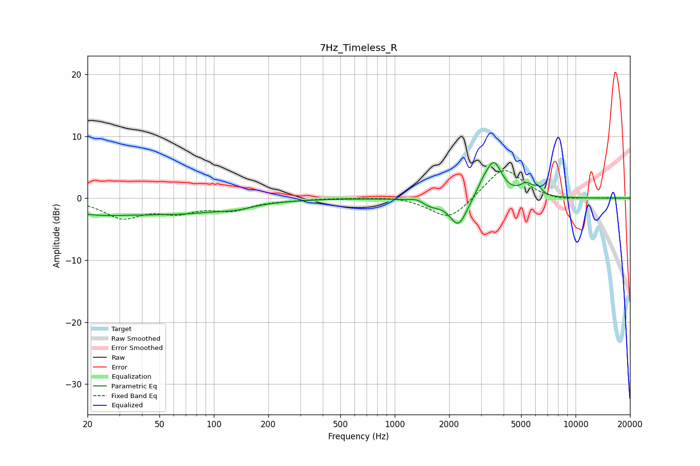

# 7Hz_Timeless_R
See [usage instructions](https://github.com/jaakkopasanen/AutoEq#usage) for more options and info.

### Parametric EQs
Apply preamp of -5.8 dB when using parametric equalizer.

|   # | Type    |   Fc (Hz) |    Q |   Gain (dB) |
|-----|---------|-----------|------|-------------|
|   1 | Peaking |        21 | 0.58 |        -2.1 |
|   2 | Peaking |        70 | 0.53 |        -1.9 |
|   3 | Peaking |       133 | 1.67 |        -0.5 |
|   4 | Peaking |      1325 | 3.83 |         0.5 |
|   5 | Peaking |      1580 | 2.73 |        -1   |
|   6 | Peaking |      2250 | 2.93 |        -4.6 |
|   7 | Peaking |      3065 | 3.96 |         1.3 |
|   8 | Peaking |      3536 | 3.11 |         5.6 |
|   9 | Peaking |      5344 | 3.86 |         1.8 |
|  10 | Peaking |      6199 | 6    |         1.1 |

### Fixed Band EQs
When using fixed band (also called graphic) equalizer, apply preamp of **-4.5 dB** (if available) and set gains manually with these parameters.

|   # | Type    |   Fc (Hz) |    Q |   Gain (dB) |
|-----|---------|-----------|------|-------------|
|   1 | Peaking |        31 | 1.41 |        -3   |
|   2 | Peaking |        62 | 1.41 |        -1.9 |
|   3 | Peaking |       125 | 1.41 |        -1.7 |
|   4 | Peaking |       250 | 1.41 |        -0.2 |
|   5 | Peaking |       500 | 1.41 |         0.1 |
|   6 | Peaking |      1000 | 1.41 |         0.3 |
|   7 | Peaking |      2000 | 1.41 |        -3.7 |
|   8 | Peaking |      4000 | 1.41 |         5.1 |
|   9 | Peaking |      8000 | 1.41 |        -0.5 |
|  10 | Peaking |     16000 | 1.41 |         0.1 |

### Graphs

