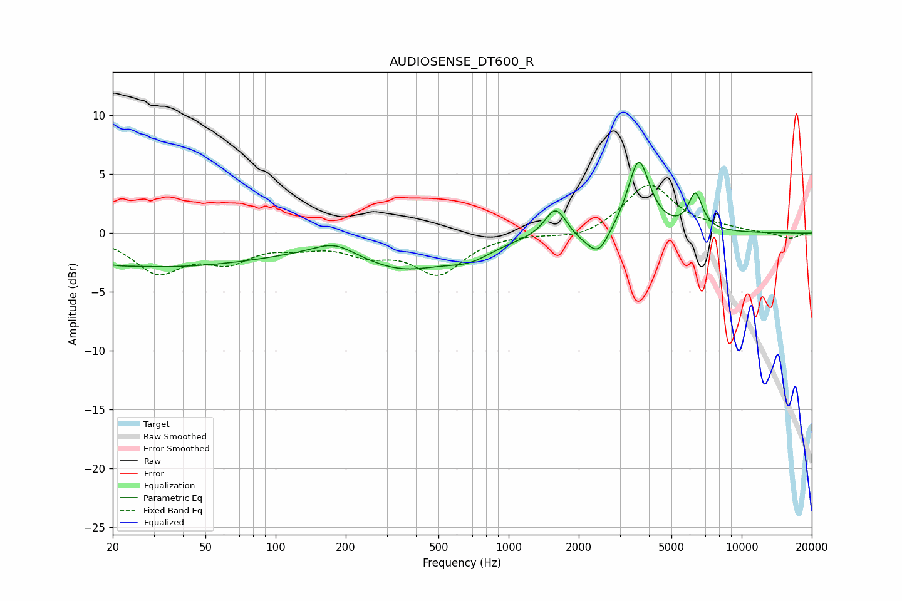

# AUDIOSENSE_DT600_R
See [usage instructions](https://github.com/jaakkopasanen/AutoEq#usage) for more options and info.

### Parametric EQs
Apply preamp of -6.1 dB when using parametric equalizer.

|   # | Type    |   Fc (Hz) |    Q |   Gain (dB) |
|-----|---------|-----------|------|-------------|
|   1 | Peaking |        21 | 3.61 |        -0.1 |
|   2 | Peaking |        32 | 0.27 |        -2.8 |
|   3 | Peaking |       178 | 1.61 |         1.1 |
|   4 | Peaking |       355 | 0.72 |        -2.7 |
|   5 | Peaking |       684 | 1.42 |        -1.2 |
|   6 | Peaking |      1594 | 3.08 |         2.6 |
|   7 | Peaking |      2030 | 2.08 |        -0.6 |
|   8 | Peaking |      2429 | 3.16 |        -2   |
|   9 | Peaking |      3617 | 3.02 |         6.3 |
|  10 | Peaking |      6338 | 4.61 |         3   |

### Fixed Band EQs
When using fixed band (also called graphic) equalizer, apply preamp of **-4.2 dB** (if available) and set gains manually with these parameters.

|   # | Type    |   Fc (Hz) |    Q |   Gain (dB) |
|-----|---------|-----------|------|-------------|
|   1 | Peaking |        31 | 1.41 |        -3.1 |
|   2 | Peaking |        62 | 1.41 |        -2   |
|   3 | Peaking |       125 | 1.41 |        -0.8 |
|   4 | Peaking |       250 | 1.41 |        -1.4 |
|   5 | Peaking |       500 | 1.41 |        -3.3 |
|   6 | Peaking |      1000 | 1.41 |         0   |
|   7 | Peaking |      2000 | 1.41 |        -0.6 |
|   8 | Peaking |      4000 | 1.41 |         4.2 |
|   9 | Peaking |      8000 | 1.41 |         0.3 |
|  10 | Peaking |     16000 | 1.41 |        -0.5 |

### Graphs

