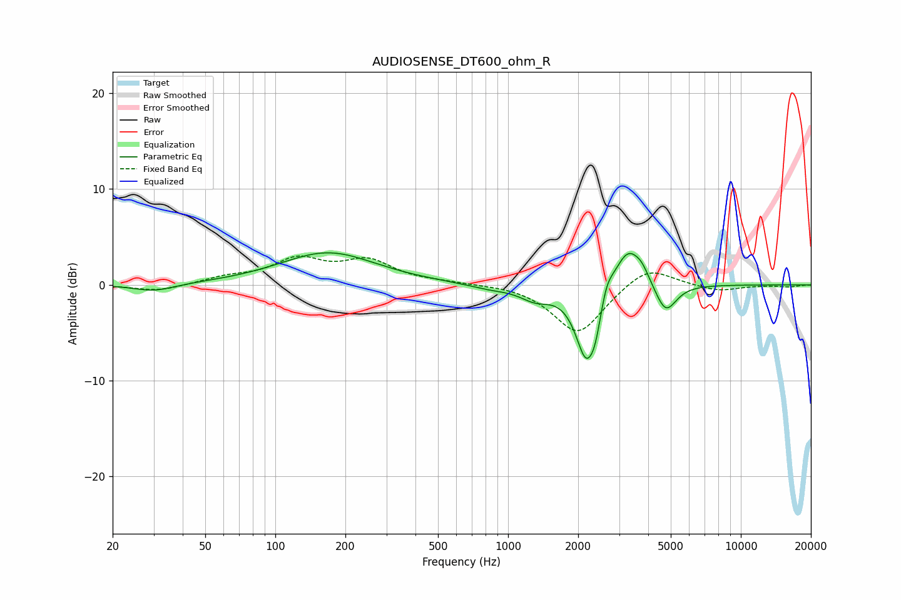

# AUDIOSENSE_DT600_ohm_R
See [usage instructions](https://github.com/jaakkopasanen/AutoEq#usage) for more options and info.

### Parametric EQs
Apply preamp of -3.4 dB when using parametric equalizer.

|   # | Type    |   Fc (Hz) |    Q |   Gain (dB) |
|-----|---------|-----------|------|-------------|
|   1 | Peaking |        30 | 1.6  |        -0.8 |
|   2 | Peaking |       168 | 0.69 |         3.4 |
|   3 | Peaking |       832 | 1.58 |        -0.4 |
|   4 | Peaking |      1310 | 2.11 |        -1.3 |
|   5 | Peaking |      2171 | 2.99 |        -7.7 |
|   6 | Peaking |      2375 | 6    |        -1.8 |
|   7 | Peaking |      2654 | 5.36 |         1.6 |
|   8 | Peaking |      3274 | 2.37 |         4.4 |
|   9 | Peaking |      3772 | 4.57 |         0.9 |
|  10 | Peaking |      4753 | 3.07 |        -3.2 |

### Fixed Band EQs
When using fixed band (also called graphic) equalizer, apply preamp of **-3.1 dB** (if available) and set gains manually with these parameters.

|   # | Type    |   Fc (Hz) |    Q |   Gain (dB) |
|-----|---------|-----------|------|-------------|
|   1 | Peaking |        31 | 1.41 |        -0.7 |
|   2 | Peaking |        62 | 1.41 |         0.7 |
|   3 | Peaking |       125 | 1.41 |         2.5 |
|   4 | Peaking |       250 | 1.41 |         2.3 |
|   5 | Peaking |       500 | 1.41 |         0.2 |
|   6 | Peaking |      1000 | 1.41 |         0.1 |
|   7 | Peaking |      2000 | 1.41 |        -5.2 |
|   8 | Peaking |      4000 | 1.41 |         2.2 |
|   9 | Peaking |      8000 | 1.41 |        -0.7 |
|  10 | Peaking |     16000 | 1.41 |        -0.2 |

### Graphs

