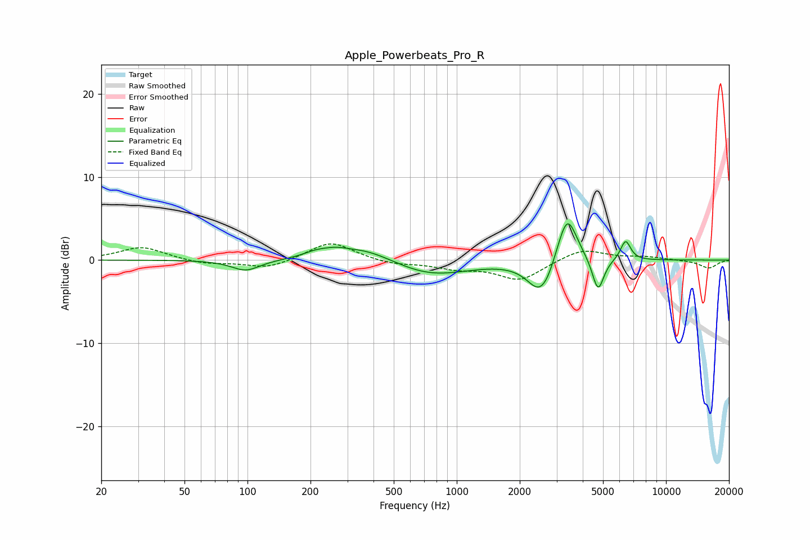

# Apple_Powerbeats_Pro_R
See [usage instructions](https://github.com/jaakkopasanen/AutoEq#usage) for more options and info.

### Parametric EQs
Apply preamp of -4.5 dB when using parametric equalizer.

|   # | Type    |   Fc (Hz) |    Q |   Gain (dB) |
|-----|---------|-----------|------|-------------|
|   1 | Peaking |        98 | 2.09 |        -1.3 |
|   2 | Peaking |       214 | 2.2  |         0.7 |
|   3 | Peaking |       265 | 2.53 |         0.5 |
|   4 | Peaking |       365 | 1.02 |         1.6 |
|   5 | Peaking |       749 | 0.78 |        -1.9 |
|   6 | Peaking |      2513 | 2.31 |        -4.2 |
|   7 | Peaking |      2741 | 6    |        -0.3 |
|   8 | Peaking |      3368 | 2.95 |         6.2 |
|   9 | Peaking |      4734 | 5.05 |        -4.1 |
|  10 | Peaking |      6410 | 5.72 |         2.4 |

### Fixed Band EQs
When using fixed band (also called graphic) equalizer, apply preamp of **-2.0 dB** (if available) and set gains manually with these parameters.

|   # | Type    |   Fc (Hz) |    Q |   Gain (dB) |
|-----|---------|-----------|------|-------------|
|   1 | Peaking |        31 | 1.41 |         1.6 |
|   2 | Peaking |        62 | 1.41 |        -0.5 |
|   3 | Peaking |       125 | 1.41 |        -1   |
|   4 | Peaking |       250 | 1.41 |         2.3 |
|   5 | Peaking |       500 | 1.41 |        -0.5 |
|   6 | Peaking |      1000 | 1.41 |        -0.9 |
|   7 | Peaking |      2000 | 1.41 |        -2.4 |
|   8 | Peaking |      4000 | 1.41 |         1.4 |
|   9 | Peaking |      8000 | 1.41 |         0.4 |
|  10 | Peaking |     16000 | 1.41 |        -1   |

### Graphs

