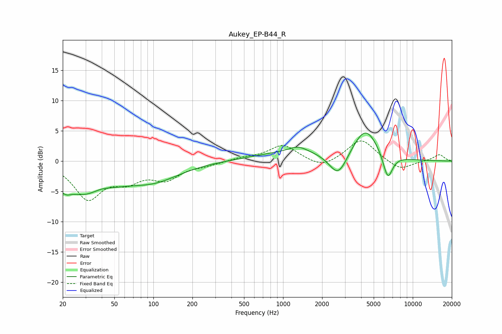

# Aukey_EP-B44_R
See [usage instructions](https://github.com/jaakkopasanen/AutoEq#usage) for more options and info.

### Parametric EQs
Apply preamp of -4.7 dB when using parametric equalizer.

|   # | Type    |   Fc (Hz) |    Q |   Gain (dB) |
|-----|---------|-----------|------|-------------|
|   1 | Peaking |        21 | 5.07 |        -4.5 |
|   2 | Peaking |        21 | 5.69 |         3.4 |
|   3 | Peaking |        30 | 0.65 |        -5.4 |
|   4 | Peaking |        39 | 1.74 |         1   |
|   5 | Peaking |       102 | 0.69 |        -2.7 |
|   6 | Peaking |      1234 | 0.48 |         1.5 |
|   7 | Peaking |      1310 | 2.05 |         0.9 |
|   8 | Peaking |      2663 | 2    |        -4.1 |
|   9 | Peaking |      4312 | 1.42 |         5.3 |
|  10 | Peaking |      6416 | 3.61 |        -4.4 |

### Fixed Band EQs
When using fixed band (also called graphic) equalizer, apply preamp of **-3.4 dB** (if available) and set gains manually with these parameters.

|   # | Type    |   Fc (Hz) |    Q |   Gain (dB) |
|-----|---------|-----------|------|-------------|
|   1 | Peaking |        31 | 1.41 |        -5.9 |
|   2 | Peaking |        62 | 1.41 |        -2.6 |
|   3 | Peaking |       125 | 1.41 |        -2.7 |
|   4 | Peaking |       250 | 1.41 |        -0.6 |
|   5 | Peaking |       500 | 1.41 |         0.5 |
|   6 | Peaking |      1000 | 1.41 |         2.6 |
|   7 | Peaking |      2000 | 1.41 |        -1.3 |
|   8 | Peaking |      4000 | 1.41 |         3.7 |
|   9 | Peaking |      8000 | 1.41 |        -1.6 |
|  10 | Peaking |     16000 | 1.41 |         1.1 |

### Graphs

