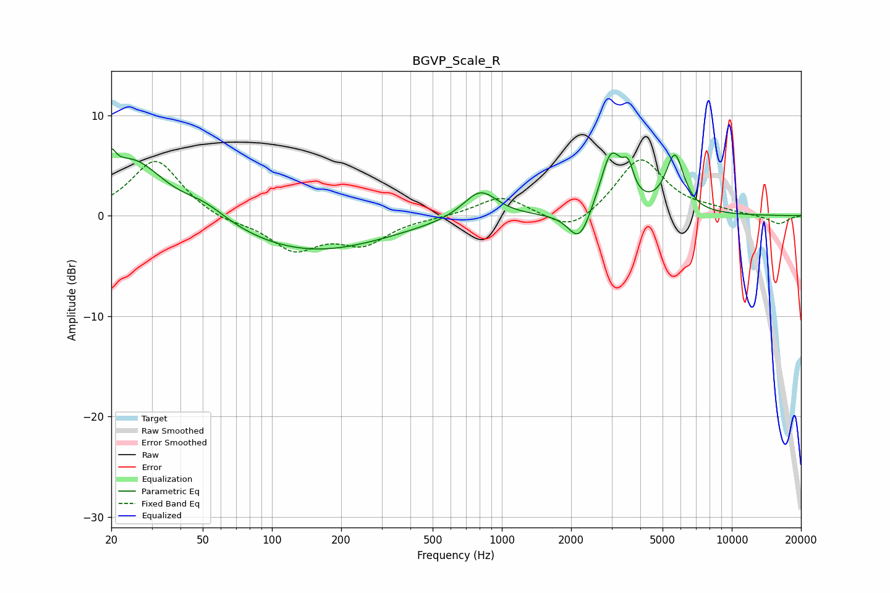

# BGVP_Scale_R
See [usage instructions](https://github.com/jaakkopasanen/AutoEq#usage) for more options and info.

### Parametric EQs
Apply preamp of -6.8 dB when using parametric equalizer.

|   # | Type    |   Fc (Hz) |    Q |   Gain (dB) |
|-----|---------|-----------|------|-------------|
|   1 | Peaking |        20 | 6    |         5.3 |
|   2 | Peaking |        20 | 5.95 |        -3.1 |
|   3 | Peaking |        25 | 1.05 |         5.6 |
|   4 | Peaking |        51 | 1.39 |         1.4 |
|   5 | Peaking |       147 | 0.42 |        -3.6 |
|   6 | Peaking |       805 | 1.91 |         2.9 |
|   7 | Peaking |      2175 | 2.93 |        -3.3 |
|   8 | Peaking |      2989 | 2.89 |         6.2 |
|   9 | Peaking |      3544 | 6    |         2.6 |
|  10 | Peaking |      5652 | 3.44 |         5.7 |

### Fixed Band EQs
When using fixed band (also called graphic) equalizer, apply preamp of **-5.7 dB** (if available) and set gains manually with these parameters.

|   # | Type    |   Fc (Hz) |    Q |   Gain (dB) |
|-----|---------|-----------|------|-------------|
|   1 | Peaking |        31 | 1.41 |         5.7 |
|   2 | Peaking |        62 | 1.41 |        -0.7 |
|   3 | Peaking |       125 | 1.41 |        -3.2 |
|   4 | Peaking |       250 | 1.41 |        -2.6 |
|   5 | Peaking |       500 | 1.41 |        -0.1 |
|   6 | Peaking |      1000 | 1.41 |         2   |
|   7 | Peaking |      2000 | 1.41 |        -2   |
|   8 | Peaking |      4000 | 1.41 |         5.8 |
|   9 | Peaking |      8000 | 1.41 |         0.4 |
|  10 | Peaking |     16000 | 1.41 |        -0.9 |

### Graphs

