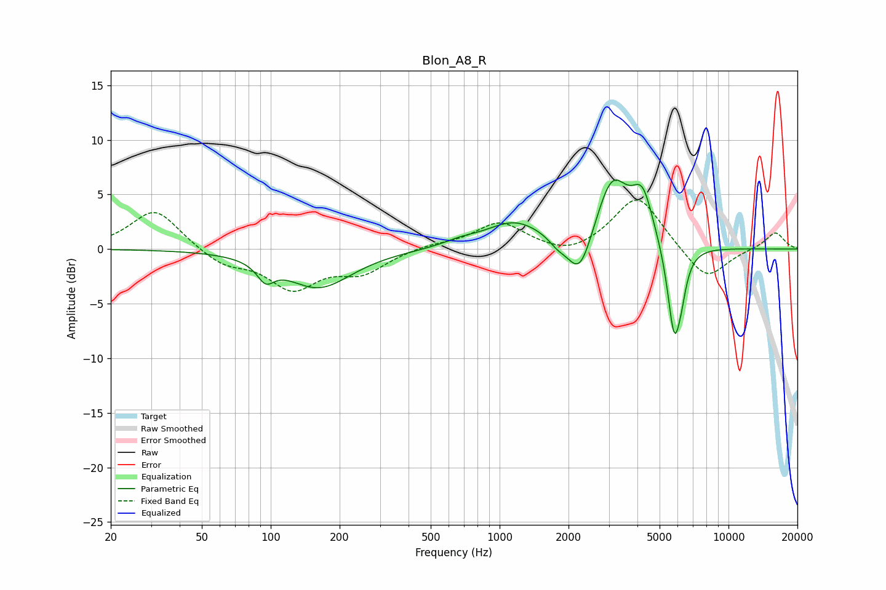

# Blon_A8_R
See [usage instructions](https://github.com/jaakkopasanen/AutoEq#usage) for more options and info.

### Parametric EQs
Apply preamp of -6.4 dB when using parametric equalizer.

|   # | Type    |   Fc (Hz) |    Q |   Gain (dB) |
|-----|---------|-----------|------|-------------|
|   1 | Peaking |        95 | 3.86 |        -1.6 |
|   2 | Peaking |       162 | 0.99 |        -3.5 |
|   3 | Peaking |       674 | 1.87 |         0.4 |
|   4 | Peaking |      1165 | 1.11 |         2.4 |
|   5 | Peaking |      1789 | 3.83 |        -0.6 |
|   6 | Peaking |      2241 | 2.55 |        -4.3 |
|   7 | Peaking |      3098 | 1.93 |         6.3 |
|   8 | Peaking |      4216 | 3.01 |         4.2 |
|   9 | Peaking |      5788 | 4.59 |        -8.2 |
|  10 | Peaking |      6211 | 6    |        -1.8 |

### Fixed Band EQs
When using fixed band (also called graphic) equalizer, apply preamp of **-4.6 dB** (if available) and set gains manually with these parameters.

|   # | Type    |   Fc (Hz) |    Q |   Gain (dB) |
|-----|---------|-----------|------|-------------|
|   1 | Peaking |        31 | 1.41 |         3.7 |
|   2 | Peaking |        62 | 1.41 |        -1.4 |
|   3 | Peaking |       125 | 1.41 |        -3.4 |
|   4 | Peaking |       250 | 1.41 |        -2   |
|   5 | Peaking |       500 | 1.41 |         0.4 |
|   6 | Peaking |      1000 | 1.41 |         2.4 |
|   7 | Peaking |      2000 | 1.41 |        -0.9 |
|   8 | Peaking |      4000 | 1.41 |         5   |
|   9 | Peaking |      8000 | 1.41 |        -3   |
|  10 | Peaking |     16000 | 1.41 |         1.6 |

### Graphs

