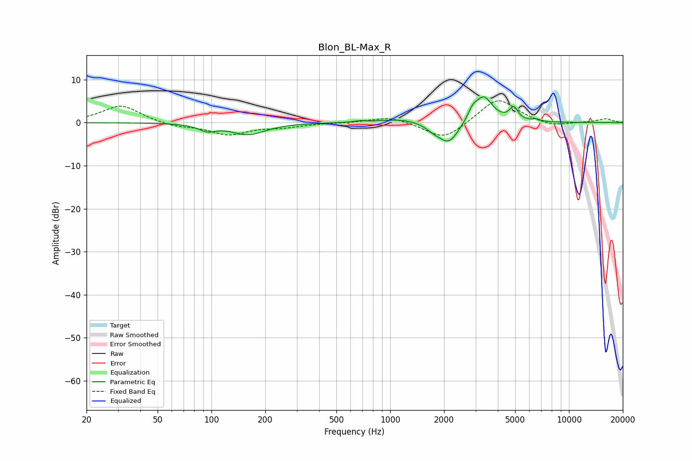

# Blon_BL-Max_R
See [usage instructions](https://github.com/jaakkopasanen/AutoEq#usage) for more options and info.

### Parametric EQs
Apply preamp of -6.1 dB when using parametric equalizer.

|   # | Type    |   Fc (Hz) |    Q |   Gain (dB) |
|-----|---------|-----------|------|-------------|
|   1 | Peaking |        95 | 3.04 |        -1.5 |
|   2 | Peaking |       160 | 1.48 |        -2.7 |
|   3 | Peaking |       678 | 4.51 |         0.3 |
|   4 | Peaking |      1159 | 1.24 |         0.9 |
|   5 | Peaking |      1753 | 3.33 |        -1.1 |
|   6 | Peaking |      2130 | 2.5  |        -5   |
|   7 | Peaking |      2886 | 5.58 |         1.9 |
|   8 | Peaking |      3327 | 2.83 |         6.1 |
|   9 | Peaking |      4910 | 6    |         2.9 |
|  10 | Peaking |      6539 | 6    |         0.5 |

### Fixed Band EQs
When using fixed band (also called graphic) equalizer, apply preamp of **-5.2 dB** (if available) and set gains manually with these parameters.

|   # | Type    |   Fc (Hz) |    Q |   Gain (dB) |
|-----|---------|-----------|------|-------------|
|   1 | Peaking |        31 | 1.41 |         4.1 |
|   2 | Peaking |        62 | 1.41 |        -0.9 |
|   3 | Peaking |       125 | 1.41 |        -2.7 |
|   4 | Peaking |       250 | 1.41 |        -0.9 |
|   5 | Peaking |       500 | 1.41 |        -0   |
|   6 | Peaking |      1000 | 1.41 |         1.5 |
|   7 | Peaking |      2000 | 1.41 |        -4.2 |
|   8 | Peaking |      4000 | 1.41 |         5.9 |
|   9 | Peaking |      8000 | 1.41 |        -1   |
|  10 | Peaking |     16000 | 1.41 |         0.9 |

### Graphs

