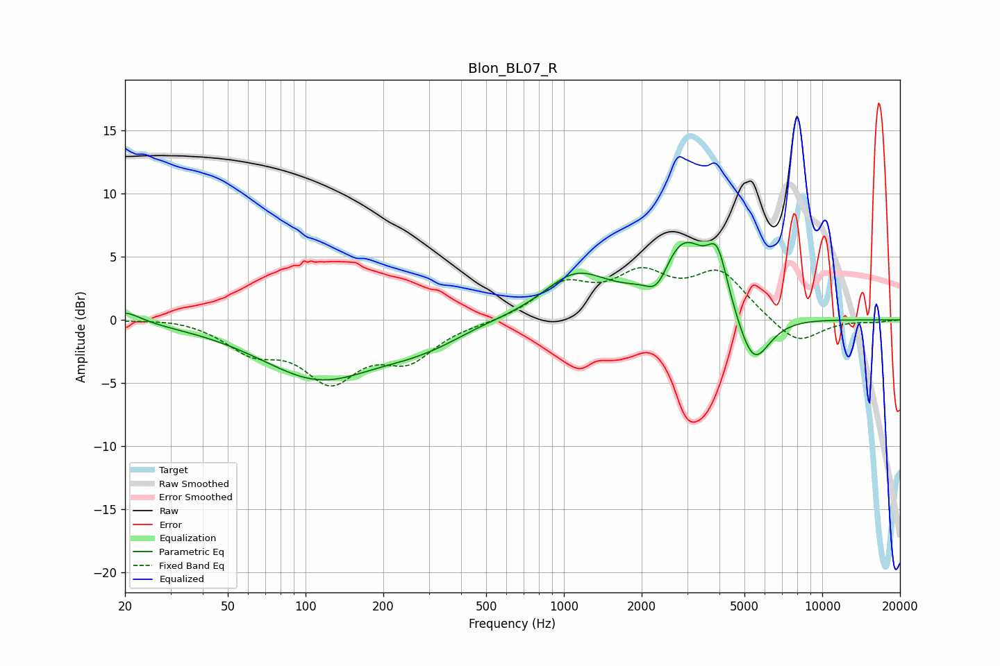

# Blon_BL07_R
See [usage instructions](https://github.com/jaakkopasanen/AutoEq#usage) for more options and info.

### Parametric EQs
Apply preamp of -6.2 dB when using parametric equalizer.

|   # | Type    |   Fc (Hz) |    Q |   Gain (dB) |
|-----|---------|-----------|------|-------------|
|   1 | Peaking |        20 | 2.25 |         0.9 |
|   2 | Peaking |       114 | 0.61 |        -4.6 |
|   3 | Peaking |       236 | 1.39 |        -0.3 |
|   4 | Peaking |       323 | 0.92 |        -1.2 |
|   5 | Peaking |       443 | 1.06 |         0.3 |
|   6 | Peaking |      1112 | 1.11 |         3.4 |
|   7 | Peaking |      2297 | 3.21 |        -2   |
|   8 | Peaking |      2898 | 1.41 |         6.1 |
|   9 | Peaking |      3930 | 3.63 |         3.7 |
|  10 | Peaking |      5405 | 2.15 |        -4.5 |

### Fixed Band EQs
When using fixed band (also called graphic) equalizer, apply preamp of **-4.2 dB** (if available) and set gains manually with these parameters.

|   # | Type    |   Fc (Hz) |    Q |   Gain (dB) |
|-----|---------|-----------|------|-------------|
|   1 | Peaking |        31 | 1.41 |         0.3 |
|   2 | Peaking |        62 | 1.41 |        -2.2 |
|   3 | Peaking |       125 | 1.41 |        -4.4 |
|   4 | Peaking |       250 | 1.41 |        -2.8 |
|   5 | Peaking |       500 | 1.41 |        -0.2 |
|   6 | Peaking |      1000 | 1.41 |         2.6 |
|   7 | Peaking |      2000 | 1.41 |         3.1 |
|   8 | Peaking |      4000 | 1.41 |         3.6 |
|   9 | Peaking |      8000 | 1.41 |        -2   |
|  10 | Peaking |     16000 | 1.41 |        -0.1 |

### Graphs

