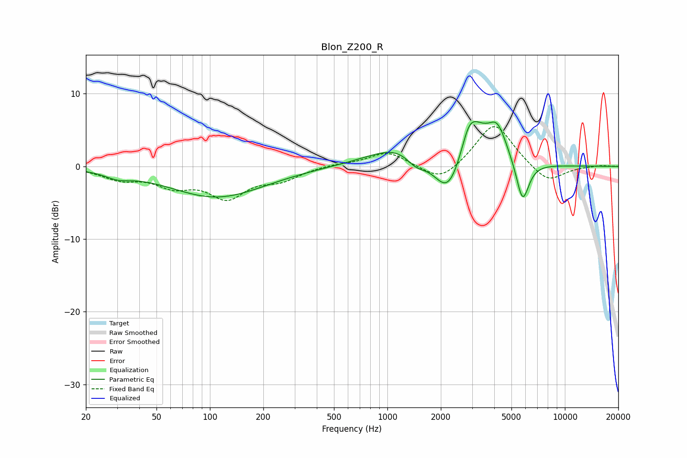

# Blon_Z200_R
See [usage instructions](https://github.com/jaakkopasanen/AutoEq#usage) for more options and info.

### Parametric EQs
Apply preamp of -6.3 dB when using parametric equalizer.

|   # | Type    |   Fc (Hz) |    Q |   Gain (dB) |
|-----|---------|-----------|------|-------------|
|   1 | Peaking |        30 | 1.95 |        -0.9 |
|   2 | Peaking |       109 | 0.53 |        -4.2 |
|   3 | Peaking |      1276 | 0.78 |         3.5 |
|   4 | Peaking |      1447 | 2.29 |        -2   |
|   5 | Peaking |      2187 | 2.2  |        -1.7 |
|   6 | Peaking |      2247 | 1.46 |        -5.2 |
|   7 | Peaking |      2866 | 3.84 |         1.8 |
|   8 | Peaking |      3032 | 1.67 |         6.2 |
|   9 | Peaking |      4168 | 2.58 |         4.4 |
|  10 | Peaking |      5778 | 3.83 |        -5.8 |

### Fixed Band EQs
When using fixed band (also called graphic) equalizer, apply preamp of **-5.6 dB** (if available) and set gains manually with these parameters.

|   # | Type    |   Fc (Hz) |    Q |   Gain (dB) |
|-----|---------|-----------|------|-------------|
|   1 | Peaking |        31 | 1.41 |        -1.5 |
|   2 | Peaking |        62 | 1.41 |        -2.3 |
|   3 | Peaking |       125 | 1.41 |        -4   |
|   4 | Peaking |       250 | 1.41 |        -1.6 |
|   5 | Peaking |       500 | 1.41 |         0.3 |
|   6 | Peaking |      1000 | 1.41 |         2   |
|   7 | Peaking |      2000 | 1.41 |        -2.4 |
|   8 | Peaking |      4000 | 1.41 |         6.2 |
|   9 | Peaking |      8000 | 1.41 |        -2.4 |
|  10 | Peaking |     16000 | 1.41 |         0.2 |

### Graphs

