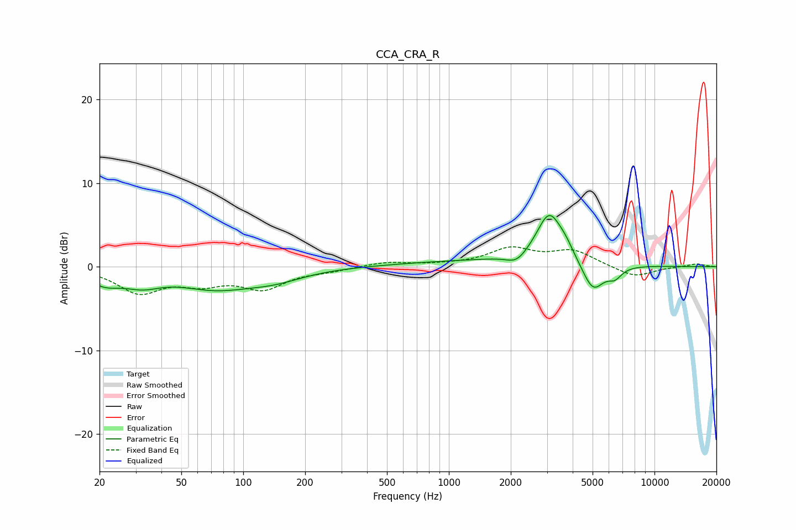

# CCA_CRA_R
See [usage instructions](https://github.com/jaakkopasanen/AutoEq#usage) for more options and info.

### Parametric EQs
Apply preamp of -6.2 dB when using parametric equalizer.

|   # | Type    |   Fc (Hz) |    Q |   Gain (dB) |
|-----|---------|-----------|------|-------------|
|   1 | Peaking |        21 | 1.81 |        -1.6 |
|   2 | Peaking |        32 | 1.52 |        -1.5 |
|   3 | Peaking |        73 | 0.76 |        -2.3 |
|   4 | Peaking |       142 | 0.97 |        -1.1 |
|   5 | Peaking |      1705 | 0.33 |         0.7 |
|   6 | Peaking |      2137 | 2.91 |        -1.1 |
|   7 | Peaking |      3074 | 2.3  |         5.7 |
|   8 | Peaking |      3692 | 3.39 |         1   |
|   9 | Peaking |      5019 | 2.63 |        -3.6 |
|  10 | Peaking |      6419 | 4.04 |        -1.2 |

### Fixed Band EQs
When using fixed band (also called graphic) equalizer, apply preamp of **-2.5 dB** (if available) and set gains manually with these parameters.

|   # | Type    |   Fc (Hz) |    Q |   Gain (dB) |
|-----|---------|-----------|------|-------------|
|   1 | Peaking |        31 | 1.41 |        -2.9 |
|   2 | Peaking |        62 | 1.41 |        -1.7 |
|   3 | Peaking |       125 | 1.41 |        -2.4 |
|   4 | Peaking |       250 | 1.41 |        -0.4 |
|   5 | Peaking |       500 | 1.41 |         0.6 |
|   6 | Peaking |      1000 | 1.41 |         0.2 |
|   7 | Peaking |      2000 | 1.41 |         2   |
|   8 | Peaking |      4000 | 1.41 |         1.8 |
|   9 | Peaking |      8000 | 1.41 |        -1.3 |
|  10 | Peaking |     16000 | 1.41 |         0.4 |

### Graphs

