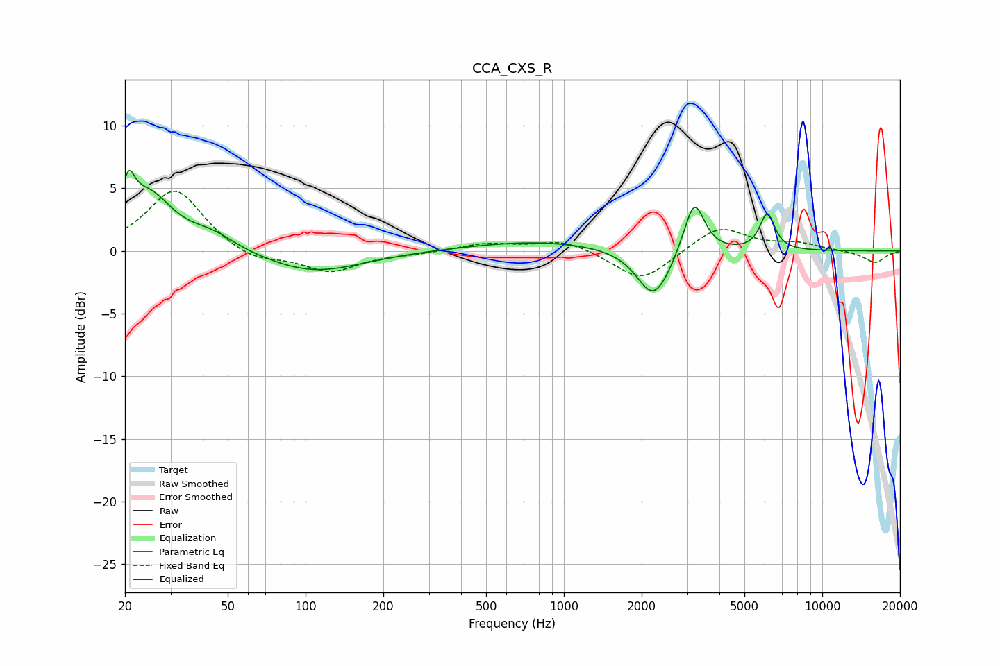

# CCA_CXS_R
See [usage instructions](https://github.com/jaakkopasanen/AutoEq#usage) for more options and info.

### Parametric EQs
Apply preamp of -6.5 dB when using parametric equalizer.

|   # | Type    |   Fc (Hz) |    Q |   Gain (dB) |
|-----|---------|-----------|------|-------------|
|   1 | Peaking |        21 | 5.91 |         3   |
|   2 | Peaking |        25 | 1.51 |         4.3 |
|   3 | Peaking |        43 | 1.56 |         1.1 |
|   4 | Peaking |       108 | 0.75 |        -1.7 |
|   5 | Peaking |       795 | 0.53 |         0.8 |
|   6 | Peaking |      2200 | 2.37 |        -3   |
|   7 | Peaking |      2452 | 1.74 |        -1.3 |
|   8 | Peaking |      2824 | 2.85 |         0.4 |
|   9 | Peaking |      3198 | 3.58 |         4.4 |
|  10 | Peaking |      6130 | 4.87 |         2.9 |

### Fixed Band EQs
When using fixed band (also called graphic) equalizer, apply preamp of **-4.9 dB** (if available) and set gains manually with these parameters.

|   # | Type    |   Fc (Hz) |    Q |   Gain (dB) |
|-----|---------|-----------|------|-------------|
|   1 | Peaking |        31 | 1.41 |         5   |
|   2 | Peaking |        62 | 1.41 |        -1   |
|   3 | Peaking |       125 | 1.41 |        -1.6 |
|   4 | Peaking |       250 | 1.41 |        -0.2 |
|   5 | Peaking |       500 | 1.41 |         0.6 |
|   6 | Peaking |      1000 | 1.41 |         0.9 |
|   7 | Peaking |      2000 | 1.41 |        -2.5 |
|   8 | Peaking |      4000 | 1.41 |         2   |
|   9 | Peaking |      8000 | 1.41 |         0.5 |
|  10 | Peaking |     16000 | 1.41 |        -0.9 |

### Graphs

