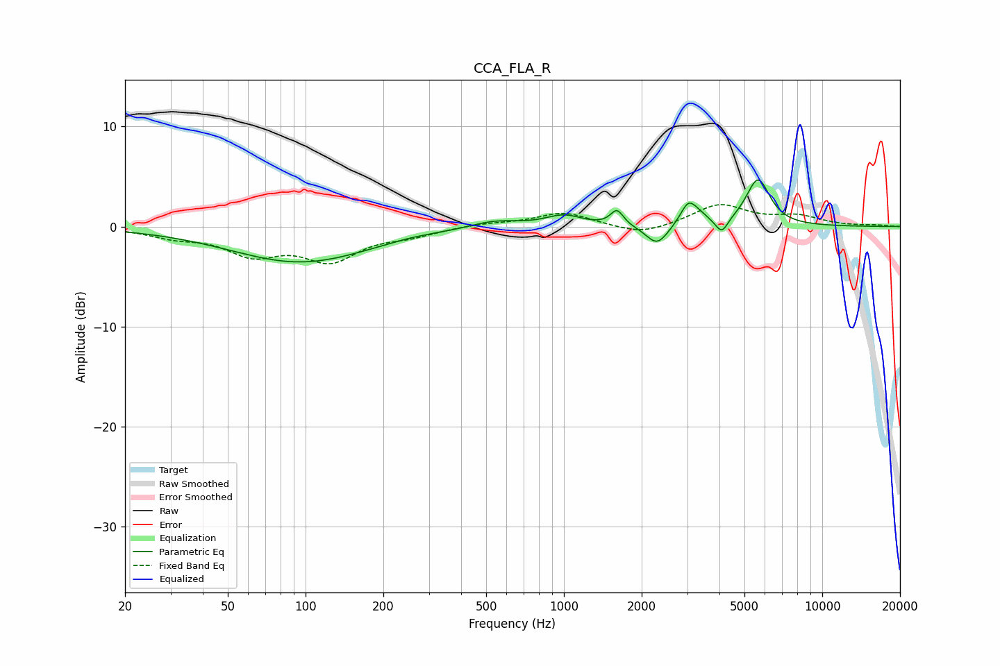

# CCA_FLA_R
See [usage instructions](https://github.com/jaakkopasanen/AutoEq#usage) for more options and info.

### Parametric EQs
Apply preamp of -4.8 dB when using parametric equalizer.

|   # | Type    |   Fc (Hz) |    Q |   Gain (dB) |
|-----|---------|-----------|------|-------------|
|   1 | Peaking |        96 | 0.52 |        -3.6 |
|   2 | Peaking |       258 | 1.49 |         0.2 |
|   3 | Peaking |       536 | 1.45 |         0.8 |
|   4 | Peaking |       999 | 2.02 |         1.1 |
|   5 | Peaking |      1605 | 5.72 |         1.6 |
|   6 | Peaking |      2296 | 3.33 |        -2   |
|   7 | Peaking |      3024 | 4.66 |         2   |
|   8 | Peaking |      3317 | 3.73 |         0.7 |
|   9 | Peaking |      4085 | 5.89 |        -1.5 |
|  10 | Peaking |      5641 | 3.02 |         4.7 |

### Fixed Band EQs
When using fixed band (also called graphic) equalizer, apply preamp of **-2.3 dB** (if available) and set gains manually with these parameters.

|   # | Type    |   Fc (Hz) |    Q |   Gain (dB) |
|-----|---------|-----------|------|-------------|
|   1 | Peaking |        31 | 1.41 |        -0.9 |
|   2 | Peaking |        62 | 1.41 |        -2.5 |
|   3 | Peaking |       125 | 1.41 |        -3.1 |
|   4 | Peaking |       250 | 1.41 |        -0.7 |
|   5 | Peaking |       500 | 1.41 |         0.3 |
|   6 | Peaking |      1000 | 1.41 |         1.4 |
|   7 | Peaking |      2000 | 1.41 |        -0.9 |
|   8 | Peaking |      4000 | 1.41 |         2.2 |
|   9 | Peaking |      8000 | 1.41 |         0.9 |
|  10 | Peaking |     16000 | 1.41 |         0.1 |

### Graphs

