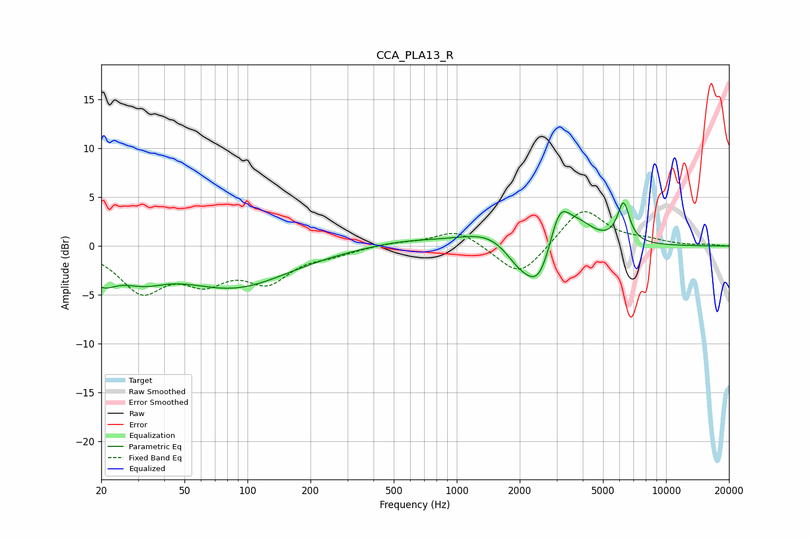

# CCA_PLA13_R
See [usage instructions](https://github.com/jaakkopasanen/AutoEq#usage) for more options and info.

### Parametric EQs
Apply preamp of -4.5 dB when using parametric equalizer.

|   # | Type    |   Fc (Hz) |    Q |   Gain (dB) |
|-----|---------|-----------|------|-------------|
|   1 | Peaking |        20 | 1.99 |        -2.6 |
|   2 | Peaking |        31 | 1.24 |        -2   |
|   3 | Peaking |        86 | 0.54 |        -4.1 |
|   4 | Peaking |       564 | 0.75 |         0.6 |
|   5 | Peaking |      1464 | 1.02 |         1.6 |
|   6 | Peaking |      1976 | 1.94 |        -1.9 |
|   7 | Peaking |      2481 | 2.07 |        -4.6 |
|   8 | Peaking |      3092 | 2.75 |         4.4 |
|   9 | Peaking |      3858 | 1.86 |         1.8 |
|  10 | Peaking |      6266 | 4.78 |         4   |

### Fixed Band EQs
When using fixed band (also called graphic) equalizer, apply preamp of **-3.6 dB** (if available) and set gains manually with these parameters.

|   # | Type    |   Fc (Hz) |    Q |   Gain (dB) |
|-----|---------|-----------|------|-------------|
|   1 | Peaking |        31 | 1.41 |        -4.3 |
|   2 | Peaking |        62 | 1.41 |        -3   |
|   3 | Peaking |       125 | 1.41 |        -3.3 |
|   4 | Peaking |       250 | 1.41 |        -0.7 |
|   5 | Peaking |       500 | 1.41 |         0.3 |
|   6 | Peaking |      1000 | 1.41 |         1.7 |
|   7 | Peaking |      2000 | 1.41 |        -3.4 |
|   8 | Peaking |      4000 | 1.41 |         4   |
|   9 | Peaking |      8000 | 1.41 |         0.5 |
|  10 | Peaking |     16000 | 1.41 |         0.1 |

### Graphs

