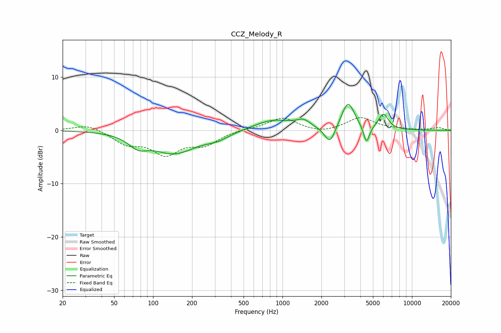

# CCZ_Melody_R
See [usage instructions](https://github.com/jaakkopasanen/AutoEq#usage) for more options and info.

### Parametric EQs
Apply preamp of -5.0 dB when using parametric equalizer.

|   # | Type    |   Fc (Hz) |    Q |   Gain (dB) |
|-----|---------|-----------|------|-------------|
|   1 | Peaking |        77 | 1.86 |        -2.2 |
|   2 | Peaking |       148 | 0.96 |        -4.6 |
|   3 | Peaking |       154 | 1.77 |         0.6 |
|   4 | Peaking |       312 | 1.48 |        -1.2 |
|   5 | Peaking |       849 | 0.95 |         2   |
|   6 | Peaking |      1450 | 2.7  |         1.3 |
|   7 | Peaking |      2325 | 3.43 |        -3.3 |
|   8 | Peaking |      3208 | 2.81 |         5.3 |
|   9 | Peaking |      4453 | 5.98 |        -3.4 |
|  10 | Peaking |      6021 | 3.64 |         2.9 |

### Fixed Band EQs
When using fixed band (also called graphic) equalizer, apply preamp of **-2.5 dB** (if available) and set gains manually with these parameters.

|   # | Type    |   Fc (Hz) |    Q |   Gain (dB) |
|-----|---------|-----------|------|-------------|
|   1 | Peaking |        31 | 1.41 |         1.2 |
|   2 | Peaking |        62 | 1.41 |        -2.3 |
|   3 | Peaking |       125 | 1.41 |        -4.1 |
|   4 | Peaking |       250 | 1.41 |        -2.4 |
|   5 | Peaking |       500 | 1.41 |         0.3 |
|   6 | Peaking |      1000 | 1.41 |         2.4 |
|   7 | Peaking |      2000 | 1.41 |        -0.6 |
|   8 | Peaking |      4000 | 1.41 |         2.4 |
|   9 | Peaking |      8000 | 1.41 |         0.2 |
|  10 | Peaking |     16000 | 1.41 |         0.5 |

### Graphs

