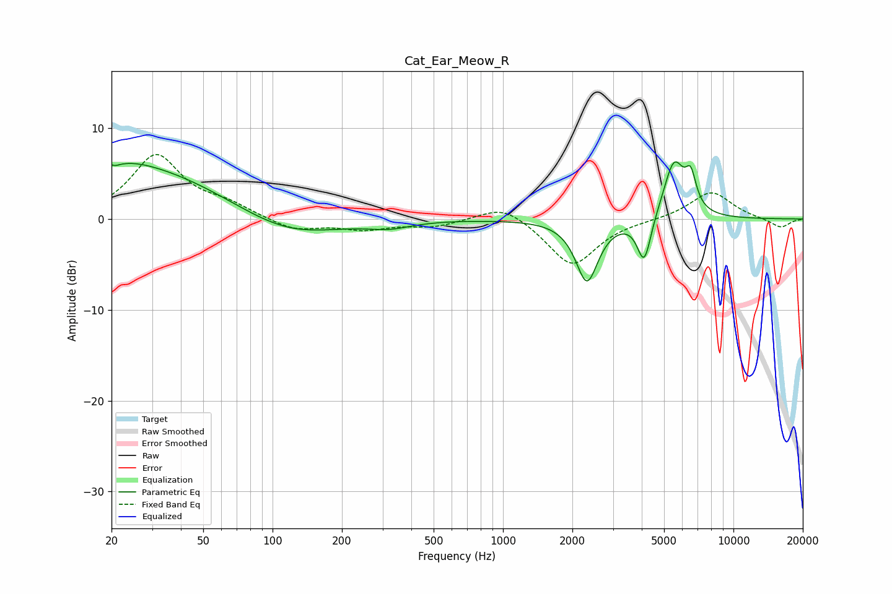

# Cat_Ear_Meow_R
See [usage instructions](https://github.com/jaakkopasanen/AutoEq#usage) for more options and info.

### Parametric EQs
Apply preamp of -6.4 dB when using parametric equalizer.

|   # | Type    |   Fc (Hz) |    Q |   Gain (dB) |
|-----|---------|-----------|------|-------------|
|   1 | Peaking |        20 | 5.63 |         3.4 |
|   2 | Peaking |        20 | 5.94 |        -3.2 |
|   3 | Peaking |        23 | 1.24 |         1   |
|   4 | Peaking |        28 | 0.41 |         5.4 |
|   5 | Peaking |       116 | 0.66 |        -2.4 |
|   6 | Peaking |       322 | 1.54 |        -0.7 |
|   7 | Peaking |      2315 | 2.91 |        -6.8 |
|   8 | Peaking |      4101 | 4.63 |        -5.2 |
|   9 | Peaking |      5524 | 2.96 |         6.4 |
|  10 | Peaking |      6533 | 5.9  |         3.3 |

### Fixed Band EQs
When using fixed band (also called graphic) equalizer, apply preamp of **-7.2 dB** (if available) and set gains manually with these parameters.

|   # | Type    |   Fc (Hz) |    Q |   Gain (dB) |
|-----|---------|-----------|------|-------------|
|   1 | Peaking |        31 | 1.41 |         6.9 |
|   2 | Peaking |        62 | 1.41 |         1.3 |
|   3 | Peaking |       125 | 1.41 |        -1.3 |
|   4 | Peaking |       250 | 1.41 |        -1   |
|   5 | Peaking |       500 | 1.41 |        -0.8 |
|   6 | Peaking |      1000 | 1.41 |         1.8 |
|   7 | Peaking |      2000 | 1.41 |        -5.2 |
|   8 | Peaking |      4000 | 1.41 |        -0.1 |
|   9 | Peaking |      8000 | 1.41 |         3.1 |
|  10 | Peaking |     16000 | 1.41 |        -1   |

### Graphs

