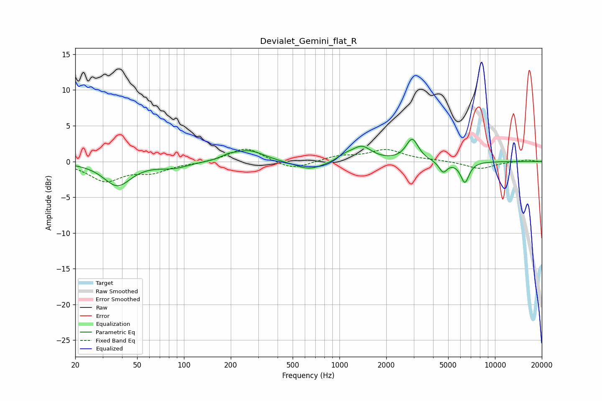

# Devialet_Gemini_flat_R
See [usage instructions](https://github.com/jaakkopasanen/AutoEq#usage) for more options and info.

### Parametric EQs
Apply preamp of -3.2 dB when using parametric equalizer.

|   # | Type    |   Fc (Hz) |    Q |   Gain (dB) |
|-----|---------|-----------|------|-------------|
|   1 | Peaking |        37 | 1.63 |        -3.3 |
|   2 | Peaking |        86 | 1.45 |        -0.8 |
|   3 | Peaking |       194 | 3.16 |         0.4 |
|   4 | Peaking |       261 | 1.44 |         1.6 |
|   5 | Peaking |       641 | 1.47 |        -1.3 |
|   6 | Peaking |      1085 | 3.07 |         0.6 |
|   7 | Peaking |      1389 | 2.22 |         2   |
|   8 | Peaking |      2934 | 3.6  |         3.1 |
|   9 | Peaking |      4640 | 5.28 |        -1.5 |
|  10 | Peaking |      6401 | 4.91 |        -2.9 |

### Fixed Band EQs
When using fixed band (also called graphic) equalizer, apply preamp of **-1.8 dB** (if available) and set gains manually with these parameters.

|   # | Type    |   Fc (Hz) |    Q |   Gain (dB) |
|-----|---------|-----------|------|-------------|
|   1 | Peaking |        31 | 1.41 |        -2.6 |
|   2 | Peaking |        62 | 1.41 |        -1.3 |
|   3 | Peaking |       125 | 1.41 |        -0.2 |
|   4 | Peaking |       250 | 1.41 |         2   |
|   5 | Peaking |       500 | 1.41 |        -1.2 |
|   6 | Peaking |      1000 | 1.41 |         0.7 |
|   7 | Peaking |      2000 | 1.41 |         1.6 |
|   8 | Peaking |      4000 | 1.41 |         0.1 |
|   9 | Peaking |      8000 | 1.41 |        -1   |
|  10 | Peaking |     16000 | 1.41 |         0.2 |

### Graphs

