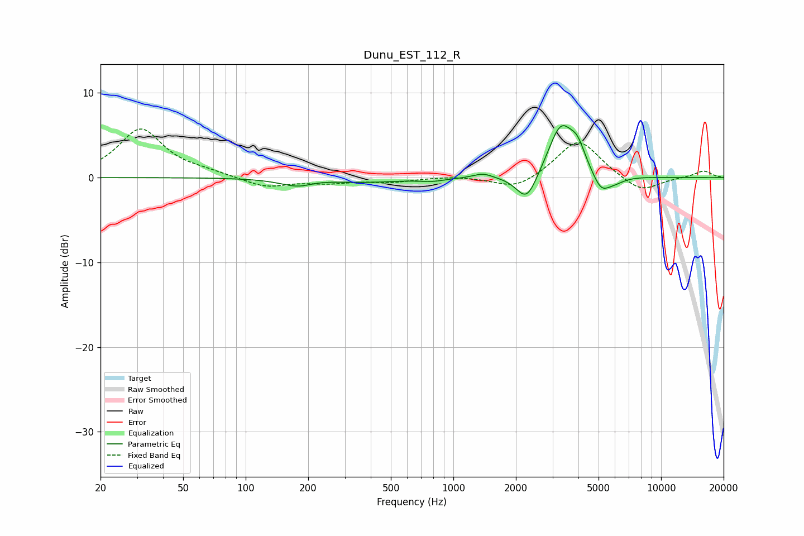

# Dunu_EST_112_R
See [usage instructions](https://github.com/jaakkopasanen/AutoEq#usage) for more options and info.

### Parametric EQs
Apply preamp of -6.2 dB when using parametric equalizer.

|   # | Type    |   Fc (Hz) |    Q |   Gain (dB) |
|-----|---------|-----------|------|-------------|
|   1 | Peaking |       184 | 1.61 |        -1.2 |
|   2 | Peaking |       209 | 1.86 |         0.5 |
|   3 | Peaking |       392 | 0.87 |        -0.5 |
|   4 | Peaking |       789 | 2.23 |        -0.3 |
|   5 | Peaking |      1386 | 3.16 |         0.6 |
|   6 | Peaking |      2256 | 2.79 |        -3.4 |
|   7 | Peaking |      3293 | 2.28 |         6.1 |
|   8 | Peaking |      3964 | 3.8  |         2.3 |
|   9 | Peaking |      5139 | 3.41 |        -2.1 |
|  10 | Peaking |      5957 | 2.72 |        -0.7 |

### Fixed Band EQs
When using fixed band (also called graphic) equalizer, apply preamp of **-5.8 dB** (if available) and set gains manually with these parameters.

|   # | Type    |   Fc (Hz) |    Q |   Gain (dB) |
|-----|---------|-----------|------|-------------|
|   1 | Peaking |        31 | 1.41 |         5.7 |
|   2 | Peaking |        62 | 1.41 |         0.5 |
|   3 | Peaking |       125 | 1.41 |        -1.2 |
|   4 | Peaking |       250 | 1.41 |        -0.5 |
|   5 | Peaking |       500 | 1.41 |        -0.5 |
|   6 | Peaking |      1000 | 1.41 |         0.2 |
|   7 | Peaking |      2000 | 1.41 |        -1.5 |
|   8 | Peaking |      4000 | 1.41 |         4.6 |
|   9 | Peaking |      8000 | 1.41 |        -1.9 |
|  10 | Peaking |     16000 | 1.41 |         0.8 |

### Graphs

