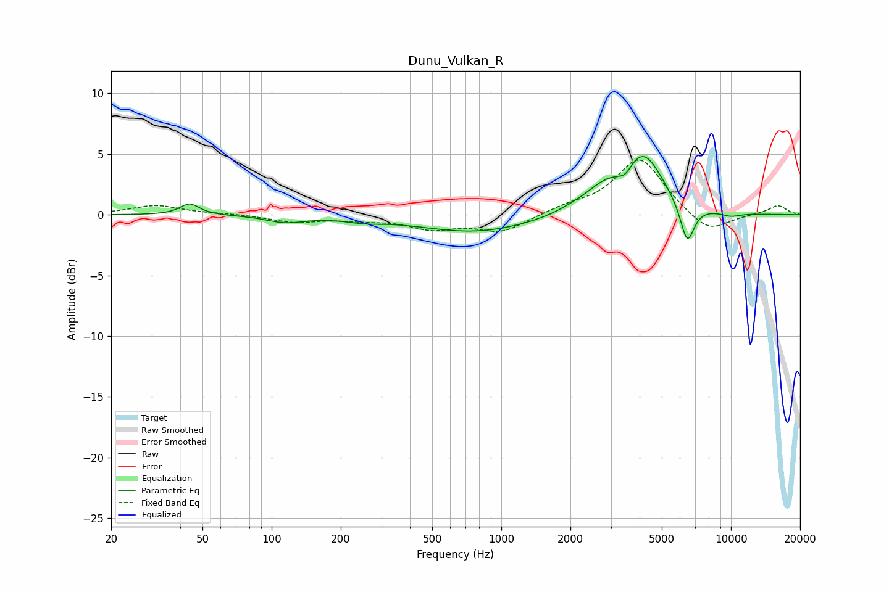

# Dunu_Vulkan_R
See [usage instructions](https://github.com/jaakkopasanen/AutoEq#usage) for more options and info.

### Parametric EQs
Apply preamp of -4.9 dB when using parametric equalizer.

|   # | Type    |   Fc (Hz) |    Q |   Gain (dB) |
|-----|---------|-----------|------|-------------|
|   1 | Peaking |        44 | 3.44 |         0.9 |
|   2 | Peaking |       115 | 1.72 |        -0.6 |
|   3 | Peaking |       252 | 1.8  |        -0.3 |
|   4 | Peaking |       774 | 0.57 |        -1.4 |
|   5 | Peaking |      2085 | 1.72 |         0.4 |
|   6 | Peaking |      2771 | 1.79 |         1.4 |
|   7 | Peaking |      3464 | 4.75 |        -0.8 |
|   8 | Peaking |      4141 | 1.58 |         4.8 |
|   9 | Peaking |      6451 | 4.44 |        -3.3 |
|  10 | Peaking |     10000 | 2.76 |        -0.3 |

### Fixed Band EQs
When using fixed band (also called graphic) equalizer, apply preamp of **-4.6 dB** (if available) and set gains manually with these parameters.

|   # | Type    |   Fc (Hz) |    Q |   Gain (dB) |
|-----|---------|-----------|------|-------------|
|   1 | Peaking |        31 | 1.41 |         0.8 |
|   2 | Peaking |        62 | 1.41 |         0.1 |
|   3 | Peaking |       125 | 1.41 |        -0.6 |
|   4 | Peaking |       250 | 1.41 |        -0.3 |
|   5 | Peaking |       500 | 1.41 |        -1   |
|   6 | Peaking |      1000 | 1.41 |        -1.4 |
|   7 | Peaking |      2000 | 1.41 |         0.6 |
|   8 | Peaking |      4000 | 1.41 |         4.7 |
|   9 | Peaking |      8000 | 1.41 |        -1.6 |
|  10 | Peaking |     16000 | 1.41 |         0.8 |

### Graphs

