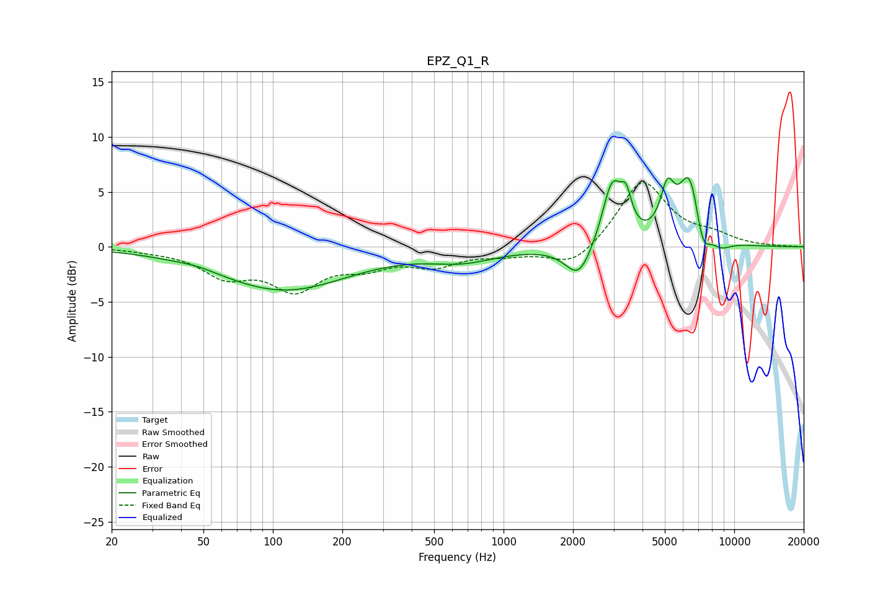

# EPZ_Q1_R
See [usage instructions](https://github.com/jaakkopasanen/AutoEq#usage) for more options and info.

### Parametric EQs
Apply preamp of -6.4 dB when using parametric equalizer.

|   # | Type    |   Fc (Hz) |    Q |   Gain (dB) |
|-----|---------|-----------|------|-------------|
|   1 | Peaking |        47 | 2.05 |         0.2 |
|   2 | Peaking |       111 | 0.5  |        -3.9 |
|   3 | Peaking |       666 | 0.98 |        -1.1 |
|   4 | Peaking |      2119 | 2.45 |        -3.1 |
|   5 | Peaking |      2956 | 3.24 |         5.7 |
|   6 | Peaking |      3399 | 6    |         2.6 |
|   7 | Peaking |      5131 | 4.58 |         4   |
|   8 | Peaking |      6409 | 2.83 |         6.6 |
|   9 | Peaking |      7282 | 4.22 |        -2.9 |
|  10 | Peaking |      8733 | 2.91 |        -0.8 |

### Fixed Band EQs
When using fixed band (also called graphic) equalizer, apply preamp of **-5.9 dB** (if available) and set gains manually with these parameters.

|   # | Type    |   Fc (Hz) |    Q |   Gain (dB) |
|-----|---------|-----------|------|-------------|
|   1 | Peaking |        31 | 1.41 |        -0.2 |
|   2 | Peaking |        62 | 1.41 |        -2.4 |
|   3 | Peaking |       125 | 1.41 |        -3.5 |
|   4 | Peaking |       250 | 1.41 |        -1.4 |
|   5 | Peaking |       500 | 1.41 |        -1.5 |
|   6 | Peaking |      1000 | 1.41 |        -0.6 |
|   7 | Peaking |      2000 | 1.41 |        -1.9 |
|   8 | Peaking |      4000 | 1.41 |         6.1 |
|   9 | Peaking |      8000 | 1.41 |         0.8 |
|  10 | Peaking |     16000 | 1.41 |         0   |

### Graphs

