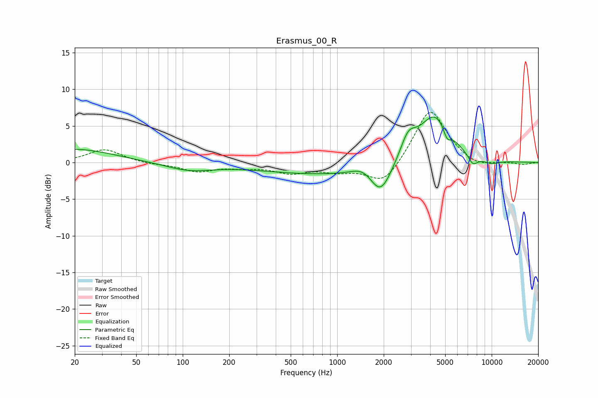

# Erasmus_00_R
See [usage instructions](https://github.com/jaakkopasanen/AutoEq#usage) for more options and info.

### Parametric EQs
Apply preamp of -6.3 dB when using parametric equalizer.

|   # | Type    |   Fc (Hz) |    Q |   Gain (dB) |
|-----|---------|-----------|------|-------------|
|   1 | Peaking |        20 | 0.57 |         1.8 |
|   2 | Peaking |       109 | 0.92 |        -1   |
|   3 | Peaking |       914 | 0.3  |        -1.6 |
|   4 | Peaking |      1480 | 1.96 |         1.2 |
|   5 | Peaking |      1908 | 2.05 |        -4.1 |
|   6 | Peaking |      2878 | 2.78 |         3   |
|   7 | Peaking |      4276 | 1.3  |         6.8 |
|   8 | Peaking |      5143 | 5.87 |        -1.5 |
|   9 | Peaking |      7545 | 4.14 |        -1.4 |
|  10 | Peaking |      9893 | 2.31 |        -0.6 |

### Fixed Band EQs
When using fixed band (also called graphic) equalizer, apply preamp of **-6.9 dB** (if available) and set gains manually with these parameters.

|   # | Type    |   Fc (Hz) |    Q |   Gain (dB) |
|-----|---------|-----------|------|-------------|
|   1 | Peaking |        31 | 1.41 |         1.8 |
|   2 | Peaking |        62 | 1.41 |        -0.2 |
|   3 | Peaking |       125 | 1.41 |        -1.2 |
|   4 | Peaking |       250 | 1.41 |        -0.5 |
|   5 | Peaking |       500 | 1.41 |        -1.3 |
|   6 | Peaking |      1000 | 1.41 |        -1   |
|   7 | Peaking |      2000 | 1.41 |        -3.2 |
|   8 | Peaking |      4000 | 1.41 |         7.5 |
|   9 | Peaking |      8000 | 1.41 |        -0.9 |
|  10 | Peaking |     16000 | 1.41 |        -0.3 |

### Graphs

