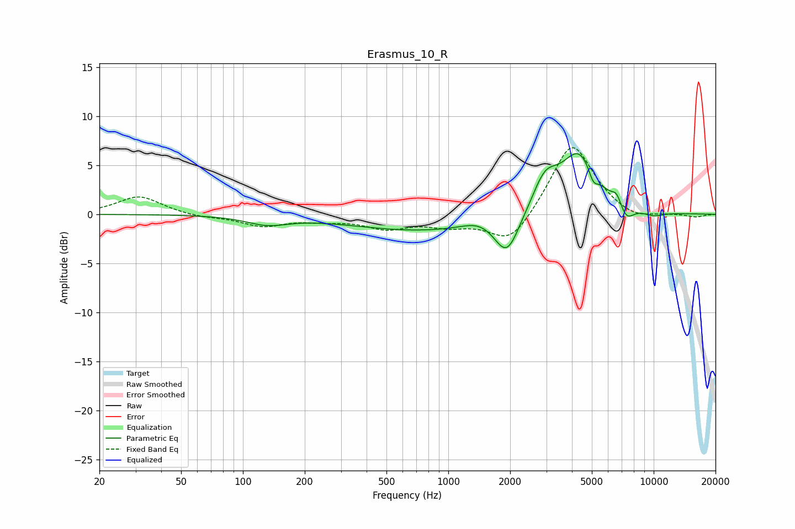

# Erasmus_10_R
See [usage instructions](https://github.com/jaakkopasanen/AutoEq#usage) for more options and info.

### Parametric EQs
Apply preamp of -6.3 dB when using parametric equalizer.

|   # | Type    |   Fc (Hz) |    Q |   Gain (dB) |
|-----|---------|-----------|------|-------------|
|   1 | Peaking |       131 | 1.39 |        -0.9 |
|   2 | Peaking |       760 | 0.4  |        -1.7 |
|   3 | Peaking |      1419 | 1.78 |         0.7 |
|   4 | Peaking |      1930 | 2.34 |        -4.1 |
|   5 | Peaking |      2953 | 2.23 |         3.3 |
|   6 | Peaking |      4341 | 1.55 |         6.1 |
|   7 | Peaking |      5078 | 6    |        -1.4 |
|   8 | Peaking |      6602 | 6    |         1.1 |
|   9 | Peaking |      7359 | 3.74 |        -1.5 |
|  10 | Peaking |     10000 | 2.47 |        -0.5 |

### Fixed Band EQs
When using fixed band (also called graphic) equalizer, apply preamp of **-6.9 dB** (if available) and set gains manually with these parameters.

|   # | Type    |   Fc (Hz) |    Q |   Gain (dB) |
|-----|---------|-----------|------|-------------|
|   1 | Peaking |        31 | 1.41 |         1.9 |
|   2 | Peaking |        62 | 1.41 |        -0.3 |
|   3 | Peaking |       125 | 1.41 |        -1.1 |
|   4 | Peaking |       250 | 1.41 |        -0.5 |
|   5 | Peaking |       500 | 1.41 |        -1.3 |
|   6 | Peaking |      1000 | 1.41 |        -1   |
|   7 | Peaking |      2000 | 1.41 |        -3.2 |
|   8 | Peaking |      4000 | 1.41 |         7.5 |
|   9 | Peaking |      8000 | 1.41 |        -0.8 |
|  10 | Peaking |     16000 | 1.41 |        -0.3 |

### Graphs

