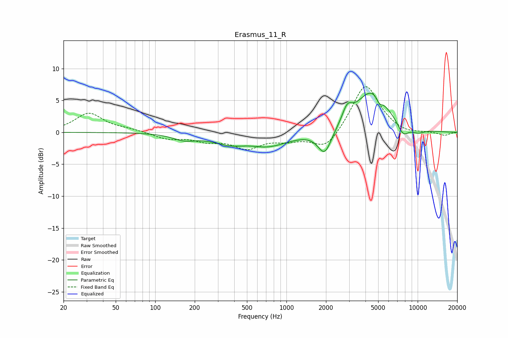

# Erasmus_11_R
See [usage instructions](https://github.com/jaakkopasanen/AutoEq#usage) for more options and info.

### Parametric EQs
Apply preamp of -6.2 dB when using parametric equalizer.

|   # | Type    |   Fc (Hz) |    Q |   Gain (dB) |
|-----|---------|-----------|------|-------------|
|   1 | Peaking |       166 | 1.68 |        -0.9 |
|   2 | Peaking |       378 | 1    |        -1.3 |
|   3 | Peaking |       532 | 1.28 |         0.8 |
|   4 | Peaking |       668 | 0.81 |        -2.4 |
|   5 | Peaking |      1956 | 2.7  |        -3.9 |
|   6 | Peaking |      2904 | 3.79 |         2.3 |
|   7 | Peaking |      4478 | 1.13 |         6.5 |
|   8 | Peaking |      5112 | 6    |        -1.1 |
|   9 | Peaking |      7740 | 3.14 |        -2   |
|  10 | Peaking |     10000 | 2.33 |        -0.7 |

### Fixed Band EQs
When using fixed band (also called graphic) equalizer, apply preamp of **-7.3 dB** (if available) and set gains manually with these parameters.

|   # | Type    |   Fc (Hz) |    Q |   Gain (dB) |
|-----|---------|-----------|------|-------------|
|   1 | Peaking |        31 | 1.41 |         3   |
|   2 | Peaking |        62 | 1.41 |         0.4 |
|   3 | Peaking |       125 | 1.41 |        -1   |
|   4 | Peaking |       250 | 1.41 |        -1.1 |
|   5 | Peaking |       500 | 1.41 |        -2.3 |
|   6 | Peaking |      1000 | 1.41 |        -1   |
|   7 | Peaking |      2000 | 1.41 |        -2.8 |
|   8 | Peaking |      4000 | 1.41 |         7.8 |
|   9 | Peaking |      8000 | 1.41 |        -0.5 |
|  10 | Peaking |     16000 | 1.41 |        -0.5 |

### Graphs

