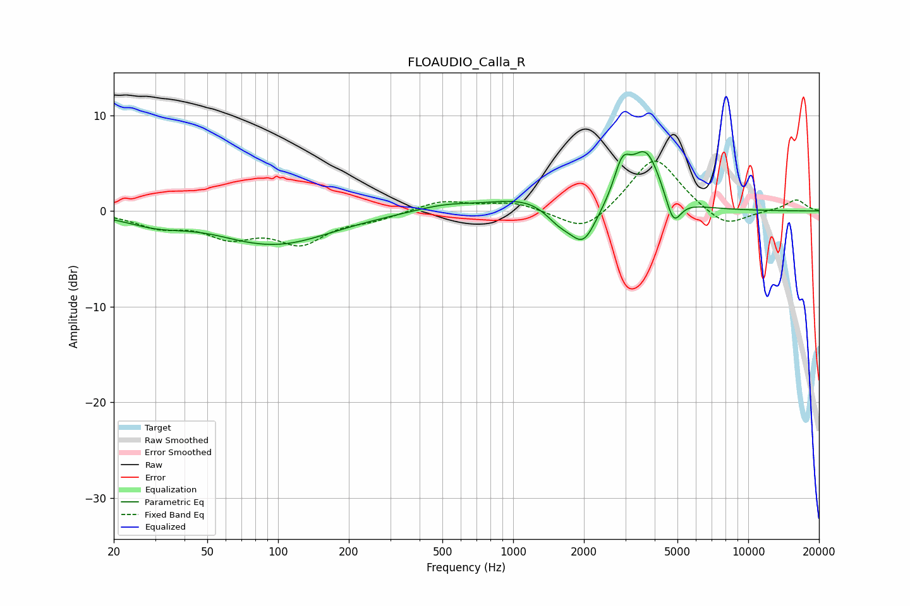

# FLOAUDIO_Calla_R
See [usage instructions](https://github.com/jaakkopasanen/AutoEq#usage) for more options and info.

### Parametric EQs
Apply preamp of -6.3 dB when using parametric equalizer.

|   # | Type    |   Fc (Hz) |    Q |   Gain (dB) |
|-----|---------|-----------|------|-------------|
|   1 | Peaking |        30 | 1.11 |        -1.1 |
|   2 | Peaking |        69 | 1.57 |        -0.1 |
|   3 | Peaking |        99 | 0.6  |        -3.4 |
|   4 | Peaking |       511 | 1.09 |         0.7 |
|   5 | Peaking |      1171 | 0.92 |         1.4 |
|   6 | Peaking |      1575 | 2.24 |        -1.7 |
|   7 | Peaking |      1993 | 2.53 |        -3.8 |
|   8 | Peaking |      2911 | 3.98 |         3.5 |
|   9 | Peaking |      3676 | 2.13 |         6   |
|  10 | Peaking |      4801 | 4.26 |        -3.2 |

### Fixed Band EQs
When using fixed band (also called graphic) equalizer, apply preamp of **-5.3 dB** (if available) and set gains manually with these parameters.

|   # | Type    |   Fc (Hz) |    Q |   Gain (dB) |
|-----|---------|-----------|------|-------------|
|   1 | Peaking |        31 | 1.41 |        -1.4 |
|   2 | Peaking |        62 | 1.41 |        -2.3 |
|   3 | Peaking |       125 | 1.41 |        -3.1 |
|   4 | Peaking |       250 | 1.41 |        -0.8 |
|   5 | Peaking |       500 | 1.41 |         1.1 |
|   6 | Peaking |      1000 | 1.41 |         0.9 |
|   7 | Peaking |      2000 | 1.41 |        -2.4 |
|   8 | Peaking |      4000 | 1.41 |         5.9 |
|   9 | Peaking |      8000 | 1.41 |        -1.9 |
|  10 | Peaking |     16000 | 1.41 |         1.2 |

### Graphs

