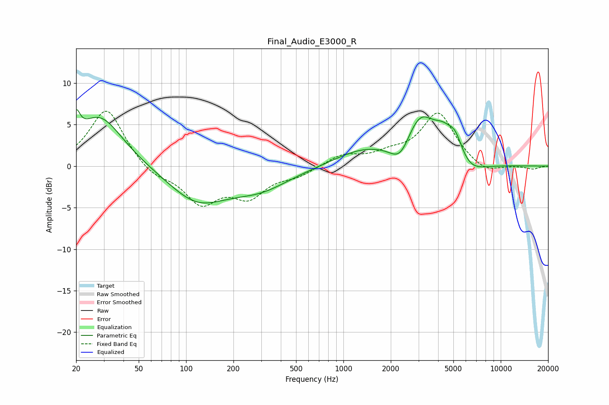

# Final_Audio_E3000_R
See [usage instructions](https://github.com/jaakkopasanen/AutoEq#usage) for more options and info.

### Parametric EQs
Apply preamp of -6.9 dB when using parametric equalizer.

|   # | Type    |   Fc (Hz) |    Q |   Gain (dB) |
|-----|---------|-----------|------|-------------|
|   1 | Peaking |        20 | 5.97 |         2.8 |
|   2 | Peaking |        28 | 0.96 |         6.1 |
|   3 | Peaking |       117 | 0.77 |        -4.1 |
|   4 | Peaking |       295 | 0.72 |        -2.4 |
|   5 | Peaking |      1331 | 0.77 |         1.8 |
|   6 | Peaking |      2303 | 2.19 |        -2.6 |
|   7 | Peaking |      3078 | 1.4  |         5.7 |
|   8 | Peaking |      4267 | 2.45 |         1.9 |
|   9 | Peaking |      5143 | 2.69 |         3   |
|  10 | Peaking |      6094 | 1.4  |        -1.9 |

### Fixed Band EQs
When using fixed band (also called graphic) equalizer, apply preamp of **-6.7 dB** (if available) and set gains manually with these parameters.

|   # | Type    |   Fc (Hz) |    Q |   Gain (dB) |
|-----|---------|-----------|------|-------------|
|   1 | Peaking |        31 | 1.41 |         7   |
|   2 | Peaking |        62 | 1.41 |        -1.3 |
|   3 | Peaking |       125 | 1.41 |        -4.2 |
|   4 | Peaking |       250 | 1.41 |        -3.3 |
|   5 | Peaking |       500 | 1.41 |        -1   |
|   6 | Peaking |      1000 | 1.41 |         1.3 |
|   7 | Peaking |      2000 | 1.41 |         1.1 |
|   8 | Peaking |      4000 | 1.41 |         6.3 |
|   9 | Peaking |      8000 | 1.41 |        -1.1 |
|  10 | Peaking |     16000 | 1.41 |        -0.4 |

### Graphs

