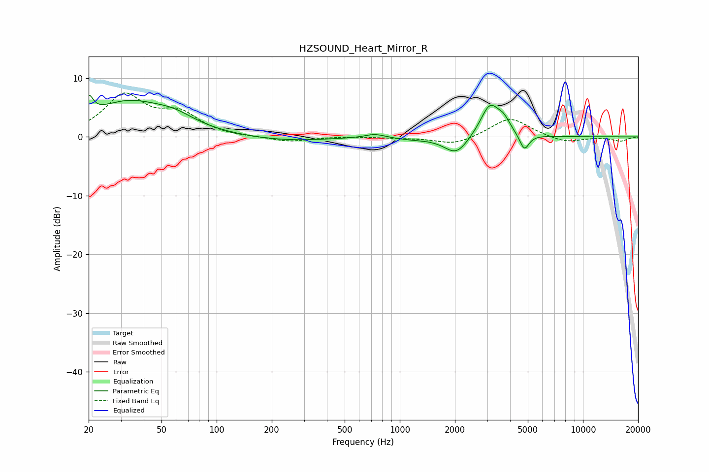

# HZSOUND_Heart_Mirror_R
See [usage instructions](https://github.com/jaakkopasanen/AutoEq#usage) for more options and info.

### Parametric EQs
Apply preamp of -7.2 dB when using parametric equalizer.

|   # | Type    |   Fc (Hz) |    Q |   Gain (dB) |
|-----|---------|-----------|------|-------------|
|   1 | Peaking |        20 | 5.98 |         3.2 |
|   2 | Peaking |        33 | 0.68 |         5.7 |
|   3 | Peaking |        59 | 1.28 |         1.6 |
|   4 | Peaking |       240 | 0.66 |        -0.7 |
|   5 | Peaking |       730 | 2.63 |         0.7 |
|   6 | Peaking |      1172 | 1.59 |        -0.3 |
|   7 | Peaking |      2036 | 2.14 |        -3.2 |
|   8 | Peaking |      3108 | 2.64 |         5.6 |
|   9 | Peaking |      3699 | 4.24 |         1.7 |
|  10 | Peaking |      4785 | 5.48 |        -2.8 |

### Fixed Band EQs
When using fixed band (also called graphic) equalizer, apply preamp of **-7.6 dB** (if available) and set gains manually with these parameters.

|   # | Type    |   Fc (Hz) |    Q |   Gain (dB) |
|-----|---------|-----------|------|-------------|
|   1 | Peaking |        31 | 1.41 |         6.8 |
|   2 | Peaking |        62 | 1.41 |         3.6 |
|   3 | Peaking |       125 | 1.41 |        -0.1 |
|   4 | Peaking |       250 | 1.41 |        -0.9 |
|   5 | Peaking |       500 | 1.41 |         0.1 |
|   6 | Peaking |      1000 | 1.41 |        -0.1 |
|   7 | Peaking |      2000 | 1.41 |        -1.4 |
|   8 | Peaking |      4000 | 1.41 |         3.3 |
|   9 | Peaking |      8000 | 1.41 |        -1   |
|  10 | Peaking |     16000 | 1.41 |        -0.7 |

### Graphs

