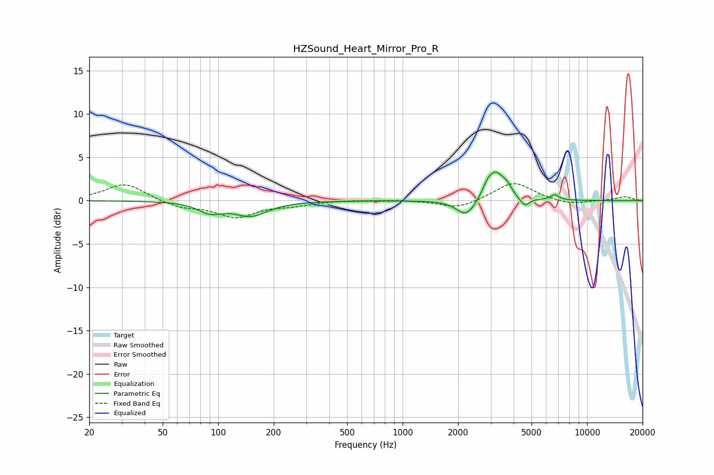

# HZSound_Heart_Mirror_Pro_R
See [usage instructions](https://github.com/jaakkopasanen/AutoEq#usage) for more options and info.

### Parametric EQs
Apply preamp of -3.4 dB when using parametric equalizer.

|   # | Type    |   Fc (Hz) |    Q |   Gain (dB) |
|-----|---------|-----------|------|-------------|
|   1 | Peaking |        91 | 2.19 |        -1.1 |
|   2 | Peaking |       143 | 1.63 |         0.2 |
|   3 | Peaking |       150 | 1.57 |        -1.9 |
|   4 | Peaking |      2216 | 2.73 |        -2   |
|   5 | Peaking |      2874 | 6    |         0.7 |
|   6 | Peaking |      3181 | 2.94 |         3.3 |
|   7 | Peaking |      3688 | 5.34 |         0.8 |
|   8 | Peaking |      4301 | 4.87 |        -0.2 |
|   9 | Peaking |      4616 | 6    |        -0.9 |
|  10 | Peaking |      6675 | 6    |         0.6 |

### Fixed Band EQs
When using fixed band (also called graphic) equalizer, apply preamp of **-2.1 dB** (if available) and set gains manually with these parameters.

|   # | Type    |   Fc (Hz) |    Q |   Gain (dB) |
|-----|---------|-----------|------|-------------|
|   1 | Peaking |        31 | 1.41 |         2   |
|   2 | Peaking |        62 | 1.41 |        -0.8 |
|   3 | Peaking |       125 | 1.41 |        -1.8 |
|   4 | Peaking |       250 | 1.41 |        -0.4 |
|   5 | Peaking |       500 | 1.41 |         0.1 |
|   6 | Peaking |      1000 | 1.41 |         0.1 |
|   7 | Peaking |      2000 | 1.41 |        -1   |
|   8 | Peaking |      4000 | 1.41 |         2.2 |
|   9 | Peaking |      8000 | 1.41 |        -0.5 |
|  10 | Peaking |     16000 | 1.41 |         0.5 |

### Graphs

