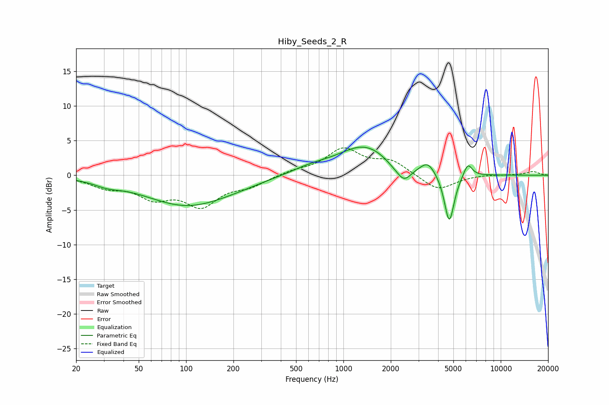

# Hiby_Seeds_2_R
See [usage instructions](https://github.com/jaakkopasanen/AutoEq#usage) for more options and info.

### Parametric EQs
Apply preamp of -4.2 dB when using parametric equalizer.

|   # | Type    |   Fc (Hz) |    Q |   Gain (dB) |
|-----|---------|-----------|------|-------------|
|   1 | Peaking |        32 | 1.76 |        -0.7 |
|   2 | Peaking |       102 | 0.53 |        -4.3 |
|   3 | Peaking |       213 | 0.99 |        -0.2 |
|   4 | Peaking |       618 | 1.06 |         0.9 |
|   5 | Peaking |      1370 | 0.84 |         4.2 |
|   6 | Peaking |      2057 | 2.34 |        -0.6 |
|   7 | Peaking |      2426 | 2.98 |        -2.3 |
|   8 | Peaking |      3440 | 3.01 |         1.7 |
|   9 | Peaking |      4708 | 4.43 |        -7.2 |
|  10 | Peaking |      6180 | 4.96 |         2   |

### Fixed Band EQs
When using fixed band (also called graphic) equalizer, apply preamp of **-4.1 dB** (if available) and set gains manually with these parameters.

|   # | Type    |   Fc (Hz) |    Q |   Gain (dB) |
|-----|---------|-----------|------|-------------|
|   1 | Peaking |        31 | 1.41 |        -1.5 |
|   2 | Peaking |        62 | 1.41 |        -2.8 |
|   3 | Peaking |       125 | 1.41 |        -4   |
|   4 | Peaking |       250 | 1.41 |        -1.3 |
|   5 | Peaking |       500 | 1.41 |         0.6 |
|   6 | Peaking |      1000 | 1.41 |         3.7 |
|   7 | Peaking |      2000 | 1.41 |         1.9 |
|   8 | Peaking |      4000 | 1.41 |        -2.3 |
|   9 | Peaking |      8000 | 1.41 |         0.1 |
|  10 | Peaking |     16000 | 1.41 |         0.5 |

### Graphs

