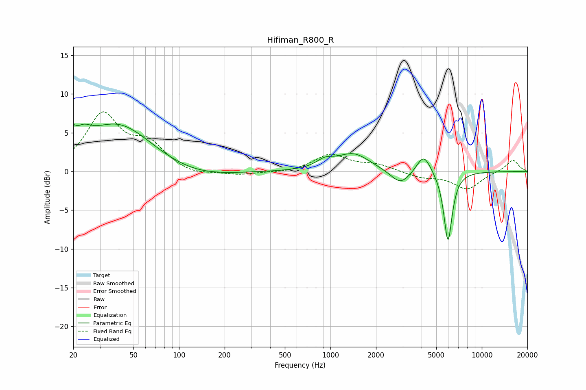

# Hifiman_R800_R
See [usage instructions](https://github.com/jaakkopasanen/AutoEq#usage) for more options and info.

### Parametric EQs
Apply preamp of -6.2 dB when using parametric equalizer.

|   # | Type    |   Fc (Hz) |    Q |   Gain (dB) |
|-----|---------|-----------|------|-------------|
|   1 | Peaking |        20 | 5.69 |         3.4 |
|   2 | Peaking |        21 | 5.98 |        -2   |
|   3 | Peaking |        23 | 2.49 |         1.8 |
|   4 | Peaking |        40 | 0.63 |         6.1 |
|   5 | Peaking |       126 | 0.63 |        -1.1 |
|   6 | Peaking |       919 | 2.52 |         1   |
|   7 | Peaking |      1418 | 1.31 |         2.3 |
|   8 | Peaking |      2905 | 2.19 |        -1.9 |
|   9 | Peaking |      4134 | 3.02 |         2.5 |
|  10 | Peaking |      5977 | 4.91 |        -9.1 |

### Fixed Band EQs
When using fixed band (also called graphic) equalizer, apply preamp of **-7.8 dB** (if available) and set gains manually with these parameters.

|   # | Type    |   Fc (Hz) |    Q |   Gain (dB) |
|-----|---------|-----------|------|-------------|
|   1 | Peaking |        31 | 1.41 |         7.1 |
|   2 | Peaking |        62 | 1.41 |         3.2 |
|   3 | Peaking |       125 | 1.41 |        -0.6 |
|   4 | Peaking |       250 | 1.41 |        -0.5 |
|   5 | Peaking |       500 | 1.41 |        -0.2 |
|   6 | Peaking |      1000 | 1.41 |         2.2 |
|   7 | Peaking |      2000 | 1.41 |         0.8 |
|   8 | Peaking |      4000 | 1.41 |        -0.7 |
|   9 | Peaking |      8000 | 1.41 |        -2.3 |
|  10 | Peaking |     16000 | 1.41 |         1.5 |

### Graphs

