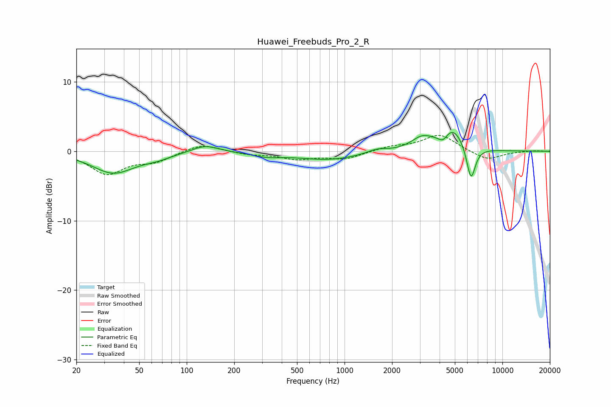

# Huawei_Freebuds_Pro_2_R
See [usage instructions](https://github.com/jaakkopasanen/AutoEq#usage) for more options and info.

### Parametric EQs
Apply preamp of -2.8 dB when using parametric equalizer.

|   # | Type    |   Fc (Hz) |    Q |   Gain (dB) |
|-----|---------|-----------|------|-------------|
|   1 | Peaking |        34 | 1.06 |        -3.1 |
|   2 | Peaking |        65 | 1.53 |        -0.6 |
|   3 | Peaking |       131 | 1.67 |         1.1 |
|   4 | Peaking |       323 | 1.48 |        -0.6 |
|   5 | Peaking |       791 | 0.73 |        -1.2 |
|   6 | Peaking |      1607 | 2.37 |         0.6 |
|   7 | Peaking |      3116 | 1.99 |         1.8 |
|   8 | Peaking |      4209 | 4.93 |        -1.1 |
|   9 | Peaking |      4859 | 1.94 |         3.2 |
|  10 | Peaking |      6325 | 4.87 |        -5   |

### Fixed Band EQs
When using fixed band (also called graphic) equalizer, apply preamp of **-2.4 dB** (if available) and set gains manually with these parameters.

|   # | Type    |   Fc (Hz) |    Q |   Gain (dB) |
|-----|---------|-----------|------|-------------|
|   1 | Peaking |        31 | 1.41 |        -3.2 |
|   2 | Peaking |        62 | 1.41 |        -1.3 |
|   3 | Peaking |       125 | 1.41 |         1.2 |
|   4 | Peaking |       250 | 1.41 |        -0.4 |
|   5 | Peaking |       500 | 1.41 |        -1   |
|   6 | Peaking |      1000 | 1.41 |        -1.1 |
|   7 | Peaking |      2000 | 1.41 |         0.6 |
|   8 | Peaking |      4000 | 1.41 |         2.4 |
|   9 | Peaking |      8000 | 1.41 |        -1.3 |
|  10 | Peaking |     16000 | 1.41 |         0.1 |

### Graphs

