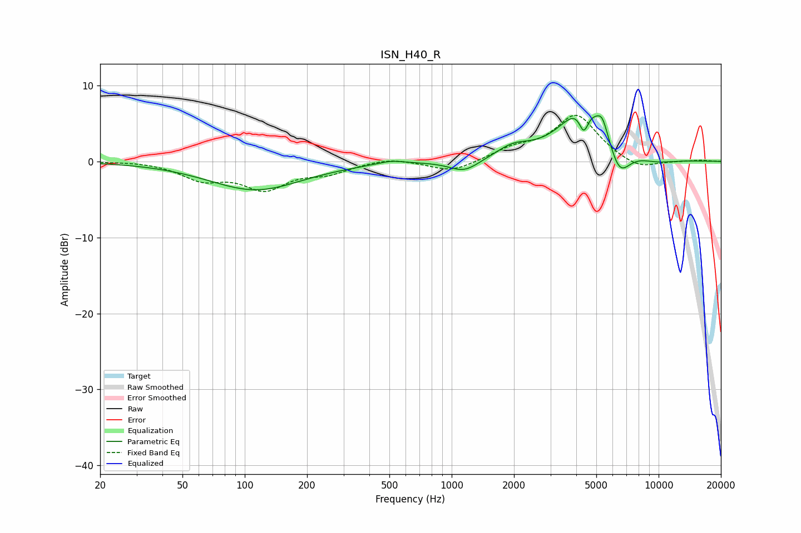

# ISN_H40_R
See [usage instructions](https://github.com/jaakkopasanen/AutoEq#usage) for more options and info.

### Parametric EQs
Apply preamp of -6.1 dB when using parametric equalizer.

|   # | Type    |   Fc (Hz) |    Q |   Gain (dB) |
|-----|---------|-----------|------|-------------|
|   1 | Peaking |       113 | 0.63 |        -3.7 |
|   2 | Peaking |       509 | 2.23 |         0.5 |
|   3 | Peaking |      1151 | 1.94 |        -1.6 |
|   4 | Peaking |      1977 | 1.74 |         1.5 |
|   5 | Peaking |      4114 | 1.72 |         2.2 |
|   6 | Peaking |      4351 | 6    |        -3.2 |
|   7 | Peaking |      4810 | 1.04 |         6.1 |
|   8 | Peaking |      5350 | 5.56 |         1.7 |
|   9 | Peaking |      6436 | 2.42 |        -5.1 |
|  10 | Peaking |      9521 | 1.23 |        -0.8 |

### Fixed Band EQs
When using fixed band (also called graphic) equalizer, apply preamp of **-6.2 dB** (if available) and set gains manually with these parameters.

|   # | Type    |   Fc (Hz) |    Q |   Gain (dB) |
|-----|---------|-----------|------|-------------|
|   1 | Peaking |        31 | 1.41 |         0.1 |
|   2 | Peaking |        62 | 1.41 |        -2.1 |
|   3 | Peaking |       125 | 1.41 |        -3.3 |
|   4 | Peaking |       250 | 1.41 |        -1.3 |
|   5 | Peaking |       500 | 1.41 |         0.6 |
|   6 | Peaking |      1000 | 1.41 |        -1.5 |
|   7 | Peaking |      2000 | 1.41 |         1.4 |
|   8 | Peaking |      4000 | 1.41 |         6   |
|   9 | Peaking |      8000 | 1.41 |        -1.3 |
|  10 | Peaking |     16000 | 1.41 |         0.2 |

### Graphs

