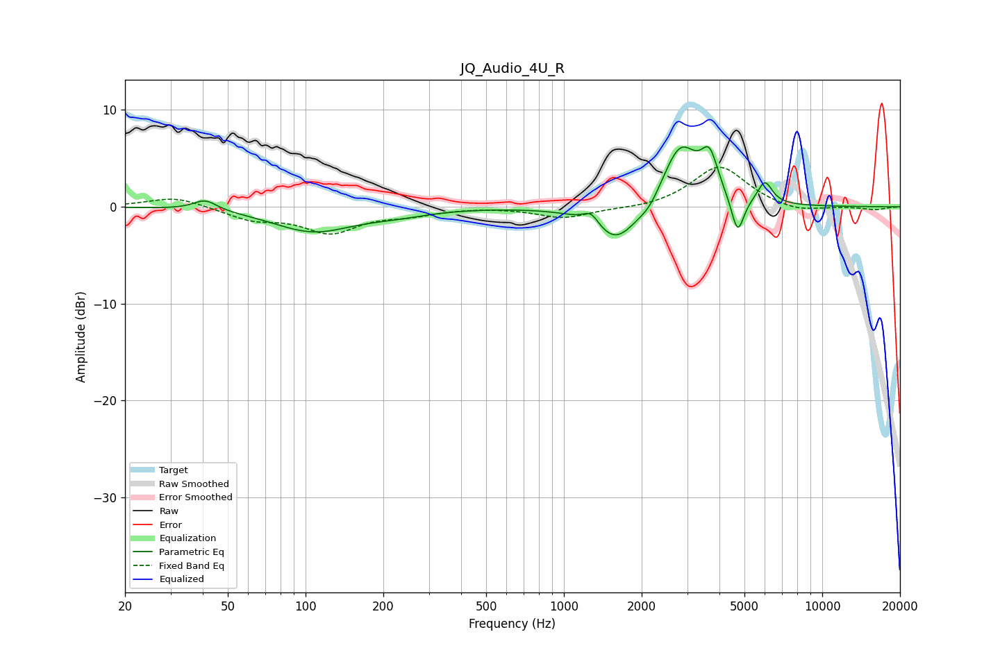

# JQ_Audio_4U_R
See [usage instructions](https://github.com/jaakkopasanen/AutoEq#usage) for more options and info.

### Parametric EQs
Apply preamp of -6.3 dB when using parametric equalizer.

|   # | Type    |   Fc (Hz) |    Q |   Gain (dB) |
|-----|---------|-----------|------|-------------|
|   1 | Peaking |        41 | 3.12 |         1.1 |
|   2 | Peaking |       107 | 0.91 |        -2.5 |
|   3 | Peaking |       227 | 1.11 |        -0.5 |
|   4 | Peaking |      1274 | 4.61 |         1.3 |
|   5 | Peaking |      1592 | 1.66 |        -4   |
|   6 | Peaking |      2144 | 3.5  |        -0.9 |
|   7 | Peaking |      2822 | 2.01 |         6.5 |
|   8 | Peaking |      3662 | 4.39 |         3.8 |
|   9 | Peaking |      4704 | 5.8  |        -3.9 |
|  10 | Peaking |      5996 | 4.89 |         2.3 |

### Fixed Band EQs
When using fixed band (also called graphic) equalizer, apply preamp of **-4.2 dB** (if available) and set gains manually with these parameters.

|   # | Type    |   Fc (Hz) |    Q |   Gain (dB) |
|-----|---------|-----------|------|-------------|
|   1 | Peaking |        31 | 1.41 |         1.1 |
|   2 | Peaking |        62 | 1.41 |        -1.2 |
|   3 | Peaking |       125 | 1.41 |        -2.5 |
|   4 | Peaking |       250 | 1.41 |        -0.7 |
|   5 | Peaking |       500 | 1.41 |         0   |
|   6 | Peaking |      1000 | 1.41 |        -1.1 |
|   7 | Peaking |      2000 | 1.41 |        -0.2 |
|   8 | Peaking |      4000 | 1.41 |         4.3 |
|   9 | Peaking |      8000 | 1.41 |        -0.7 |
|  10 | Peaking |     16000 | 1.41 |        -0.3 |

### Graphs

