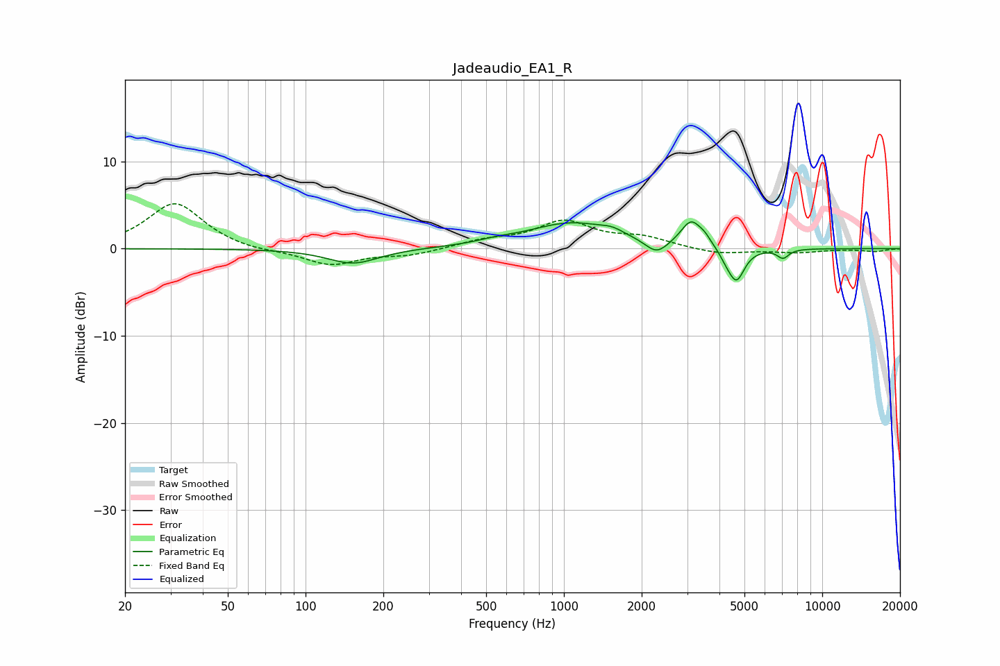

# Jadeaudio_EA1_R
See [usage instructions](https://github.com/jaakkopasanen/AutoEq#usage) for more options and info.

### Parametric EQs
Apply preamp of -3.2 dB when using parametric equalizer.

|   # | Type    |   Fc (Hz) |    Q |   Gain (dB) |
|-----|---------|-----------|------|-------------|
|   1 | Peaking |       153 | 1.43 |        -1.7 |
|   2 | Peaking |       544 | 2.06 |         0.3 |
|   3 | Peaking |      1075 | 0.82 |         2.9 |
|   4 | Peaking |      1535 | 3.37 |         0.5 |
|   5 | Peaking |      2285 | 3.22 |        -1.6 |
|   6 | Peaking |      3109 | 3.54 |         2.9 |
|   7 | Peaking |      3512 | 6    |         0.6 |
|   8 | Peaking |      4243 | 6    |        -0.7 |
|   9 | Peaking |      4654 | 4.44 |        -3.8 |
|  10 | Peaking |      7050 | 6    |        -1   |

### Fixed Band EQs
When using fixed band (also called graphic) equalizer, apply preamp of **-5.2 dB** (if available) and set gains manually with these parameters.

|   # | Type    |   Fc (Hz) |    Q |   Gain (dB) |
|-----|---------|-----------|------|-------------|
|   1 | Peaking |        31 | 1.41 |         5.3 |
|   2 | Peaking |        62 | 1.41 |        -0.4 |
|   3 | Peaking |       125 | 1.41 |        -1.9 |
|   4 | Peaking |       250 | 1.41 |        -0.7 |
|   5 | Peaking |       500 | 1.41 |         0.8 |
|   6 | Peaking |      1000 | 1.41 |         3   |
|   7 | Peaking |      2000 | 1.41 |         1.1 |
|   8 | Peaking |      4000 | 1.41 |        -0.7 |
|   9 | Peaking |      8000 | 1.41 |        -0.4 |
|  10 | Peaking |     16000 | 1.41 |        -0.3 |

### Graphs

