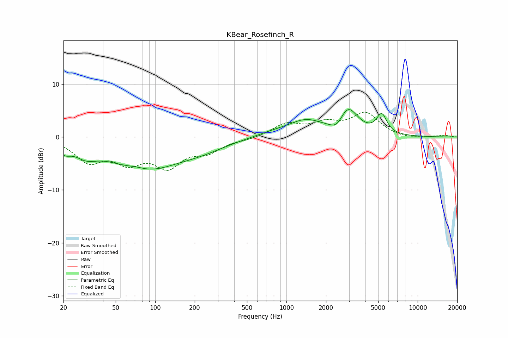

# KBear_Rosefinch_R
See [usage instructions](https://github.com/jaakkopasanen/AutoEq#usage) for more options and info.

### Parametric EQs
Apply preamp of -5.3 dB when using parametric equalizer.

|   # | Type    |   Fc (Hz) |    Q |   Gain (dB) |
|-----|---------|-----------|------|-------------|
|   1 | Peaking |        20 | 3.23 |        -1.5 |
|   2 | Peaking |        30 | 1.68 |        -2.1 |
|   3 | Peaking |        72 | 1.83 |         0.7 |
|   4 | Peaking |        81 | 0.55 |        -6   |
|   5 | Peaking |       226 | 0.72 |        -1.6 |
|   6 | Peaking |       795 | 0.93 |         0.8 |
|   7 | Peaking |      1408 | 1.1  |         2.8 |
|   8 | Peaking |      2441 | 2.62 |        -2.1 |
|   9 | Peaking |      2923 | 1.87 |         5.4 |
|  10 | Peaking |      5321 | 3.59 |         3.6 |

### Fixed Band EQs
When using fixed band (also called graphic) equalizer, apply preamp of **-4.8 dB** (if available) and set gains manually with these parameters.

|   # | Type    |   Fc (Hz) |    Q |   Gain (dB) |
|-----|---------|-----------|------|-------------|
|   1 | Peaking |        31 | 1.41 |        -4.2 |
|   2 | Peaking |        62 | 1.41 |        -4   |
|   3 | Peaking |       125 | 1.41 |        -5   |
|   4 | Peaking |       250 | 1.41 |        -2.4 |
|   5 | Peaking |       500 | 1.41 |        -0.4 |
|   6 | Peaking |      1000 | 1.41 |         2.4 |
|   7 | Peaking |      2000 | 1.41 |         2.2 |
|   8 | Peaking |      4000 | 1.41 |         4.3 |
|   9 | Peaking |      8000 | 1.41 |        -0.4 |
|  10 | Peaking |     16000 | 1.41 |         0.3 |

### Graphs

