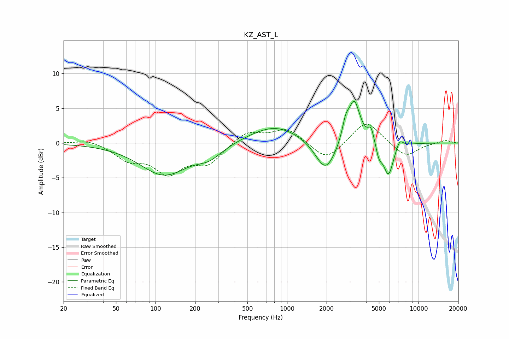

# KZ_AST_L
See [usage instructions](https://github.com/jaakkopasanen/AutoEq#usage) for more options and info.

### Parametric EQs
Apply preamp of -6.1 dB when using parametric equalizer.

|   # | Type    |   Fc (Hz) |    Q |   Gain (dB) |
|-----|---------|-----------|------|-------------|
|   1 | Peaking |       116 | 0.77 |        -4.5 |
|   2 | Peaking |       257 | 1.48 |        -1.5 |
|   3 | Peaking |       809 | 0.72 |         2.6 |
|   4 | Peaking |      1965 | 1.83 |        -4.6 |
|   5 | Peaking |      2791 | 5.55 |         2.2 |
|   6 | Peaking |      3242 | 3.08 |         6.2 |
|   7 | Peaking |      4363 | 6    |         2   |
|   8 | Peaking |      5011 | 5.98 |        -1.7 |
|   9 | Peaking |      5908 | 3.57 |        -4.7 |
|  10 | Peaking |      7183 | 5.15 |         1.3 |

### Fixed Band EQs
When using fixed band (also called graphic) equalizer, apply preamp of **-2.8 dB** (if available) and set gains manually with these parameters.

|   # | Type    |   Fc (Hz) |    Q |   Gain (dB) |
|-----|---------|-----------|------|-------------|
|   1 | Peaking |        31 | 1.41 |         0.6 |
|   2 | Peaking |        62 | 1.41 |        -2.2 |
|   3 | Peaking |       125 | 1.41 |        -4   |
|   4 | Peaking |       250 | 1.41 |        -2.8 |
|   5 | Peaking |       500 | 1.41 |         1.8 |
|   6 | Peaking |      1000 | 1.41 |         2.1 |
|   7 | Peaking |      2000 | 1.41 |        -2.6 |
|   8 | Peaking |      4000 | 1.41 |         3.4 |
|   9 | Peaking |      8000 | 1.41 |        -2.1 |
|  10 | Peaking |     16000 | 1.41 |         0.4 |

### Graphs

