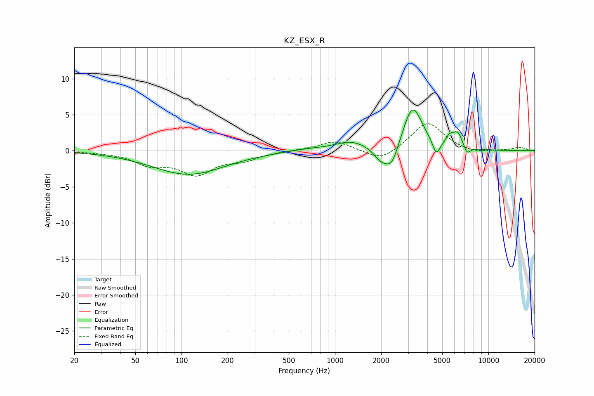

# KZ_ESX_R
See [usage instructions](https://github.com/jaakkopasanen/AutoEq#usage) for more options and info.

### Parametric EQs
Apply preamp of -5.8 dB when using parametric equalizer.

|   # | Type    |   Fc (Hz) |    Q |   Gain (dB) |
|-----|---------|-----------|------|-------------|
|   1 | Peaking |       111 | 0.6  |        -3.3 |
|   2 | Peaking |       668 | 1.13 |         0.3 |
|   3 | Peaking |      1264 | 1.43 |         1.2 |
|   4 | Peaking |      1965 | 3.34 |        -1.4 |
|   5 | Peaking |      2334 | 3.03 |        -3.3 |
|   6 | Peaking |      3204 | 2.23 |         6.3 |
|   7 | Peaking |      4575 | 5.92 |        -2   |
|   8 | Peaking |      5571 | 6    |         1.1 |
|   9 | Peaking |      6302 | 4.17 |         2.2 |
|  10 | Peaking |      7250 | 5.93 |        -1.2 |

### Fixed Band EQs
When using fixed band (also called graphic) equalizer, apply preamp of **-3.8 dB** (if available) and set gains manually with these parameters.

|   # | Type    |   Fc (Hz) |    Q |   Gain (dB) |
|-----|---------|-----------|------|-------------|
|   1 | Peaking |        31 | 1.41 |        -0.1 |
|   2 | Peaking |        62 | 1.41 |        -1.7 |
|   3 | Peaking |       125 | 1.41 |        -3   |
|   4 | Peaking |       250 | 1.41 |        -1.1 |
|   5 | Peaking |       500 | 1.41 |         0   |
|   6 | Peaking |      1000 | 1.41 |         1.4 |
|   7 | Peaking |      2000 | 1.41 |        -1.6 |
|   8 | Peaking |      4000 | 1.41 |         4   |
|   9 | Peaking |      8000 | 1.41 |        -0.5 |
|  10 | Peaking |     16000 | 1.41 |         0.5 |

### Graphs

