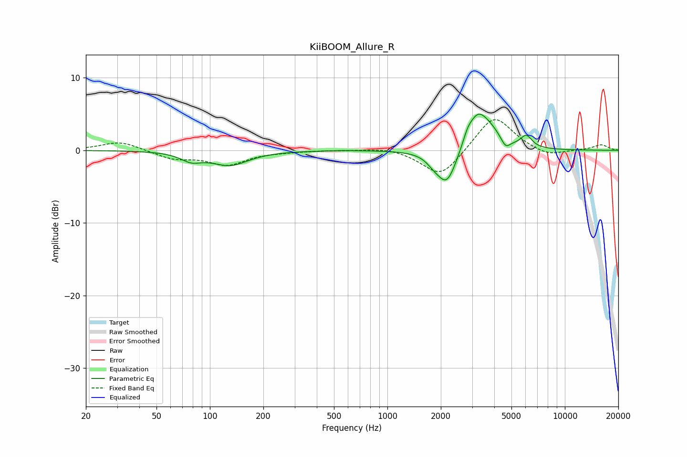

# KiiBOOM_Allure_R
See [usage instructions](https://github.com/jaakkopasanen/AutoEq#usage) for more options and info.

### Parametric EQs
Apply preamp of -5.1 dB when using parametric equalizer.

|   # | Type    |   Fc (Hz) |    Q |   Gain (dB) |
|-----|---------|-----------|------|-------------|
|   1 | Peaking |        78 | 2.42 |        -1.1 |
|   2 | Peaking |       129 | 1.35 |        -2   |
|   3 | Peaking |       567 | 1.9  |         0.1 |
|   4 | Peaking |      1819 | 3.7  |        -0.7 |
|   5 | Peaking |      2164 | 2.51 |        -5   |
|   6 | Peaking |      2829 | 6    |         0.9 |
|   7 | Peaking |      3214 | 2.33 |         4.7 |
|   8 | Peaking |      3845 | 2.2  |         1.6 |
|   9 | Peaking |      4634 | 5.59 |        -1.3 |
|  10 | Peaking |      6060 | 4.31 |         1.6 |

### Fixed Band EQs
When using fixed band (also called graphic) equalizer, apply preamp of **-4.3 dB** (if available) and set gains manually with these parameters.

|   # | Type    |   Fc (Hz) |    Q |   Gain (dB) |
|-----|---------|-----------|------|-------------|
|   1 | Peaking |        31 | 1.41 |         1.3 |
|   2 | Peaking |        62 | 1.41 |        -1.1 |
|   3 | Peaking |       125 | 1.41 |        -1.9 |
|   4 | Peaking |       250 | 1.41 |        -0.1 |
|   5 | Peaking |       500 | 1.41 |         0   |
|   6 | Peaking |      1000 | 1.41 |         0.5 |
|   7 | Peaking |      2000 | 1.41 |        -3.8 |
|   8 | Peaking |      4000 | 1.41 |         5   |
|   9 | Peaking |      8000 | 1.41 |        -0.9 |
|  10 | Peaking |     16000 | 1.41 |         0.8 |

### Graphs

