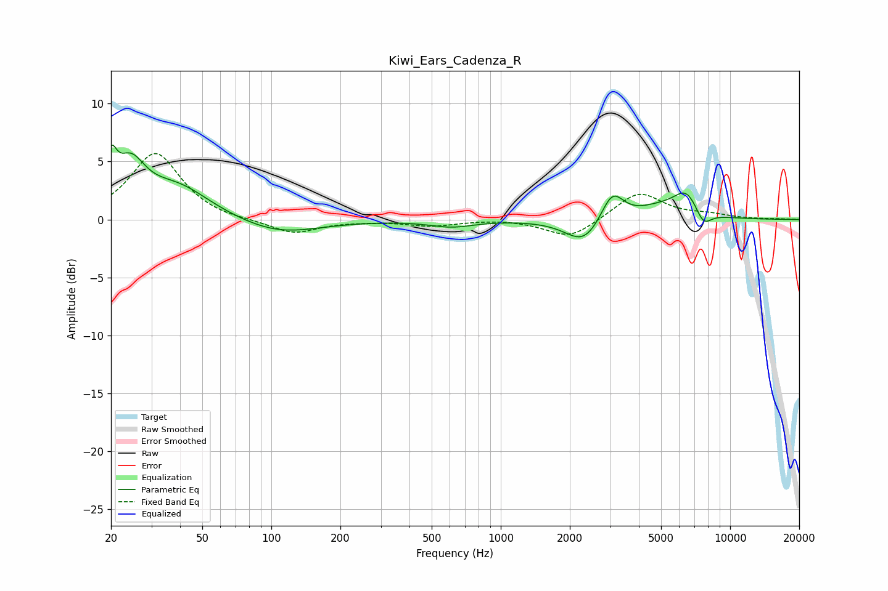

# Kiwi_Ears_Cadenza_R
See [usage instructions](https://github.com/jaakkopasanen/AutoEq#usage) for more options and info.

### Parametric EQs
Apply preamp of -6.5 dB when using parametric equalizer.

|   # | Type    |   Fc (Hz) |    Q |   Gain (dB) |
|-----|---------|-----------|------|-------------|
|   1 | Peaking |        20 | 5.9  |         3.2 |
|   2 | Peaking |        24 | 2.19 |         3.9 |
|   3 | Peaking |        39 | 0.98 |         2.7 |
|   4 | Peaking |       107 | 0.8  |        -1.3 |
|   5 | Peaking |       611 | 1.47 |        -0.6 |
|   6 | Peaking |      2306 | 1.79 |        -2.2 |
|   7 | Peaking |      3061 | 2.84 |         2.6 |
|   8 | Peaking |      4880 | 1.4  |         0.9 |
|   9 | Peaking |      6443 | 2.4  |         2.1 |
|  10 | Peaking |      7634 | 3.8  |        -1.4 |

### Fixed Band EQs
When using fixed band (also called graphic) equalizer, apply preamp of **-5.8 dB** (if available) and set gains manually with these parameters.

|   # | Type    |   Fc (Hz) |    Q |   Gain (dB) |
|-----|---------|-----------|------|-------------|
|   1 | Peaking |        31 | 1.41 |         5.8 |
|   2 | Peaking |        62 | 1.41 |        -0.2 |
|   3 | Peaking |       125 | 1.41 |        -1.2 |
|   4 | Peaking |       250 | 1.41 |        -0.1 |
|   5 | Peaking |       500 | 1.41 |        -0.5 |
|   6 | Peaking |      1000 | 1.41 |         0.1 |
|   7 | Peaking |      2000 | 1.41 |        -1.7 |
|   8 | Peaking |      4000 | 1.41 |         2.4 |
|   9 | Peaking |      8000 | 1.41 |         0.3 |
|  10 | Peaking |     16000 | 1.41 |         0   |

### Graphs

