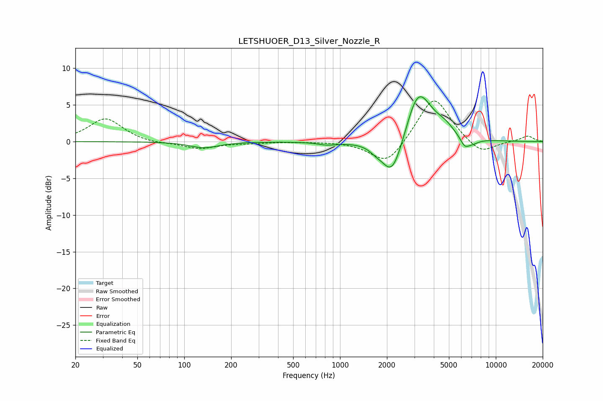

# LETSHUOER_D13_Silver_Nozzle_R
See [usage instructions](https://github.com/jaakkopasanen/AutoEq#usage) for more options and info.

### Parametric EQs
Apply preamp of -6.2 dB when using parametric equalizer.

|   # | Type    |   Fc (Hz) |    Q |   Gain (dB) |
|-----|---------|-----------|------|-------------|
|   1 | Peaking |       134 | 1.54 |        -0.8 |
|   2 | Peaking |       831 | 2.25 |        -0.4 |
|   3 | Peaking |      1692 | 3.82 |        -0.5 |
|   4 | Peaking |      2149 | 2.13 |        -4.7 |
|   5 | Peaking |      2332 | 1.66 |        -1.2 |
|   6 | Peaking |      3139 | 1.84 |         6   |
|   7 | Peaking |      3533 | 1.36 |         1.7 |
|   8 | Peaking |      4740 | 2.46 |         1   |
|   9 | Peaking |      6319 | 4.49 |        -1.3 |
|  10 | Peaking |      7097 | 3.3  |        -0.6 |

### Fixed Band EQs
When using fixed band (also called graphic) equalizer, apply preamp of **-5.6 dB** (if available) and set gains manually with these parameters.

|   # | Type    |   Fc (Hz) |    Q |   Gain (dB) |
|-----|---------|-----------|------|-------------|
|   1 | Peaking |        31 | 1.41 |         3.2 |
|   2 | Peaking |        62 | 1.41 |        -0.3 |
|   3 | Peaking |       125 | 1.41 |        -1   |
|   4 | Peaking |       250 | 1.41 |        -0.2 |
|   5 | Peaking |       500 | 1.41 |        -0   |
|   6 | Peaking |      1000 | 1.41 |         0   |
|   7 | Peaking |      2000 | 1.41 |        -3.3 |
|   8 | Peaking |      4000 | 1.41 |         6.4 |
|   9 | Peaking |      8000 | 1.41 |        -1.9 |
|  10 | Peaking |     16000 | 1.41 |         0.8 |

### Graphs

