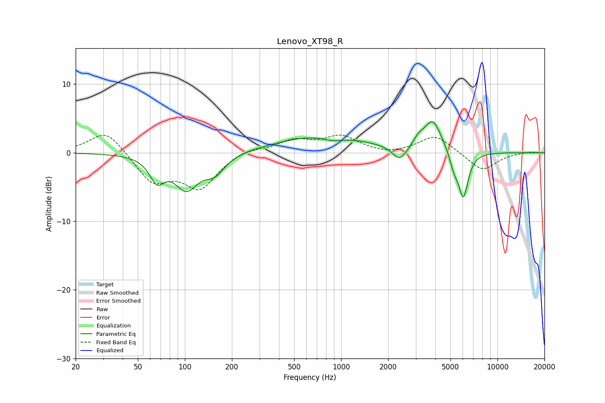

# Lenovo_XT98_R
See [usage instructions](https://github.com/jaakkopasanen/AutoEq#usage) for more options and info.

### Parametric EQs
Apply preamp of -4.6 dB when using parametric equalizer.

|   # | Type    |   Fc (Hz) |    Q |   Gain (dB) |
|-----|---------|-----------|------|-------------|
|   1 | Peaking |        66 | 3.01 |        -3.3 |
|   2 | Peaking |       102 | 1.83 |        -4.9 |
|   3 | Peaking |       156 | 2.18 |        -2.5 |
|   4 | Peaking |       761 | 0.49 |         2.6 |
|   5 | Peaking |       882 | 2.03 |        -0.7 |
|   6 | Peaking |      2370 | 3.11 |        -2.2 |
|   7 | Peaking |      3121 | 4.53 |         1   |
|   8 | Peaking |      3855 | 2.51 |         4.6 |
|   9 | Peaking |      5265 | 5.29 |        -2   |
|  10 | Peaking |      6047 | 4.35 |        -6.7 |

### Fixed Band EQs
When using fixed band (also called graphic) equalizer, apply preamp of **-2.7 dB** (if available) and set gains manually with these parameters.

|   # | Type    |   Fc (Hz) |    Q |   Gain (dB) |
|-----|---------|-----------|------|-------------|
|   1 | Peaking |        31 | 1.41 |         3.4 |
|   2 | Peaking |        62 | 1.41 |        -4.2 |
|   3 | Peaking |       125 | 1.41 |        -4.9 |
|   4 | Peaking |       250 | 1.41 |         0.7 |
|   5 | Peaking |       500 | 1.41 |         1.7 |
|   6 | Peaking |      1000 | 1.41 |         2.3 |
|   7 | Peaking |      2000 | 1.41 |        -0.4 |
|   8 | Peaking |      4000 | 1.41 |         2.6 |
|   9 | Peaking |      8000 | 1.41 |        -2.7 |
|  10 | Peaking |     16000 | 1.41 |         0.1 |

### Graphs

