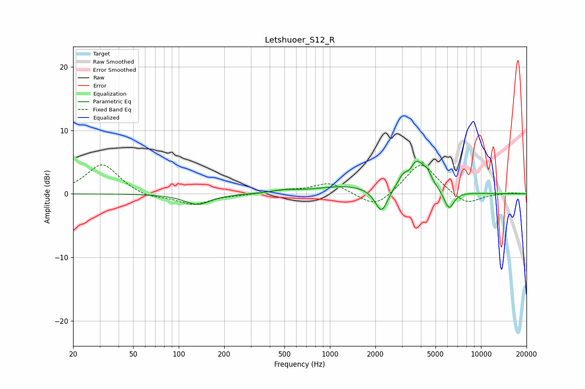

# Letshuoer_S12_R
See [usage instructions](https://github.com/jaakkopasanen/AutoEq#usage) for more options and info.

### Parametric EQs
Apply preamp of -5.2 dB when using parametric equalizer.

|   # | Type    |   Fc (Hz) |    Q |   Gain (dB) |
|-----|---------|-----------|------|-------------|
|   1 | Peaking |       132 | 1.53 |        -1.3 |
|   2 | Peaking |       135 | 1.96 |        -0.4 |
|   3 | Peaking |       498 | 1.78 |         0.4 |
|   4 | Peaking |      1269 | 0.74 |         1.2 |
|   5 | Peaking |      2197 | 3.34 |        -4   |
|   6 | Peaking |      3007 | 6    |         0.7 |
|   7 | Peaking |      3402 | 6    |        -0.8 |
|   8 | Peaking |      3705 | 2.09 |         5.4 |
|   9 | Peaking |      4436 | 6    |         1   |
|  10 | Peaking |      6141 | 4.08 |        -3   |

### Fixed Band EQs
When using fixed band (also called graphic) equalizer, apply preamp of **-4.6 dB** (if available) and set gains manually with these parameters.

|   # | Type    |   Fc (Hz) |    Q |   Gain (dB) |
|-----|---------|-----------|------|-------------|
|   1 | Peaking |        31 | 1.41 |         4.7 |
|   2 | Peaking |        62 | 1.41 |        -0.7 |
|   3 | Peaking |       125 | 1.41 |        -1.7 |
|   4 | Peaking |       250 | 1.41 |        -0.1 |
|   5 | Peaking |       500 | 1.41 |         0.5 |
|   6 | Peaking |      1000 | 1.41 |         1.8 |
|   7 | Peaking |      2000 | 1.41 |        -2.4 |
|   8 | Peaking |      4000 | 1.41 |         5.1 |
|   9 | Peaking |      8000 | 1.41 |        -1.9 |
|  10 | Peaking |     16000 | 1.41 |         0.2 |

### Graphs

