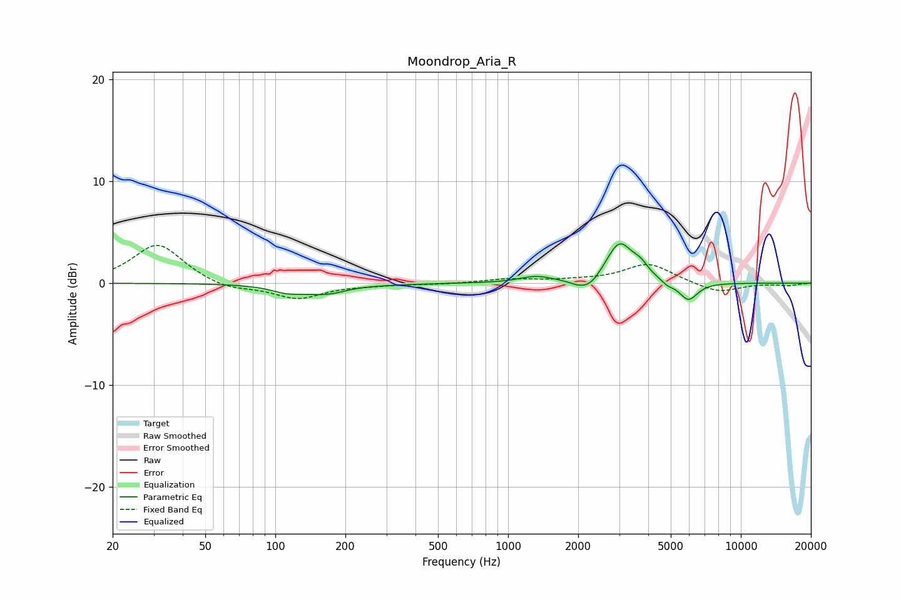

# Moondrop_Aria_R
See [usage instructions](https://github.com/jaakkopasanen/AutoEq#usage) for more options and info.

### Parametric EQs
Apply preamp of -4.0 dB when using parametric equalizer.

|   # | Type    |   Fc (Hz) |    Q |   Gain (dB) |
|-----|---------|-----------|------|-------------|
|   1 | Peaking |       111 | 2.22 |        -0.5 |
|   2 | Peaking |       170 | 1.2  |        -1.2 |
|   3 | Peaking |       211 | 1.58 |         0.3 |
|   4 | Peaking |      1318 | 2.02 |         0.6 |
|   5 | Peaking |      1974 | 3.77 |        -0.3 |
|   6 | Peaking |      2235 | 2.99 |        -1.1 |
|   7 | Peaking |      3009 | 2.47 |         3.9 |
|   8 | Peaking |      3711 | 4.22 |         0.9 |
|   9 | Peaking |      4848 | 5.77 |        -0.4 |
|  10 | Peaking |      5951 | 3.43 |        -1.8 |

### Fixed Band EQs
When using fixed band (also called graphic) equalizer, apply preamp of **-3.8 dB** (if available) and set gains manually with these parameters.

|   # | Type    |   Fc (Hz) |    Q |   Gain (dB) |
|-----|---------|-----------|------|-------------|
|   1 | Peaking |        31 | 1.41 |         3.9 |
|   2 | Peaking |        62 | 1.41 |        -0.7 |
|   3 | Peaking |       125 | 1.41 |        -1.5 |
|   4 | Peaking |       250 | 1.41 |        -0.1 |
|   5 | Peaking |       500 | 1.41 |        -0.1 |
|   6 | Peaking |      1000 | 1.41 |         0.4 |
|   7 | Peaking |      2000 | 1.41 |         0.2 |
|   8 | Peaking |      4000 | 1.41 |         1.9 |
|   9 | Peaking |      8000 | 1.41 |        -1   |
|  10 | Peaking |     16000 | 1.41 |        -0.2 |

### Graphs

