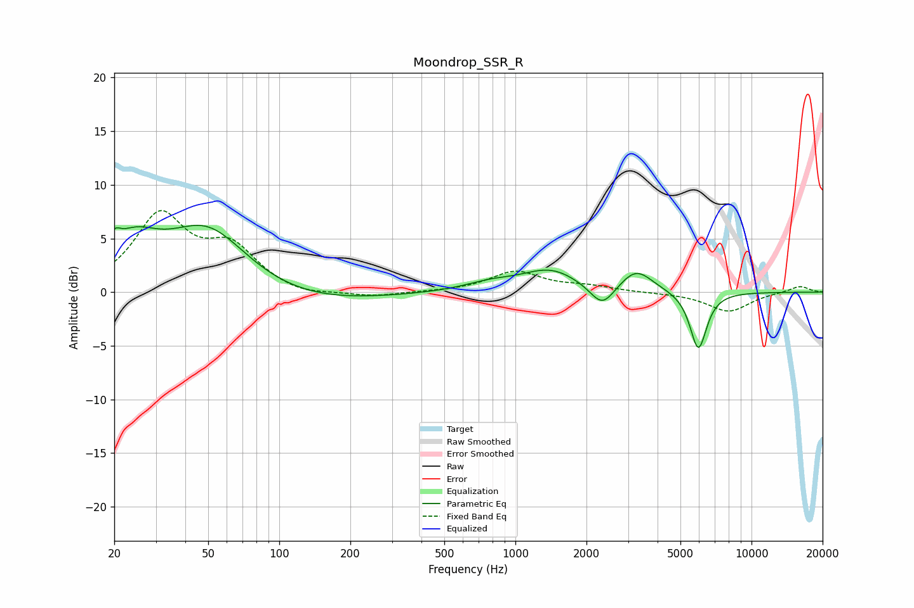

# Moondrop_SSR_R
See [usage instructions](https://github.com/jaakkopasanen/AutoEq#usage) for more options and info.

### Parametric EQs
Apply preamp of -6.3 dB when using parametric equalizer.

|   # | Type    |   Fc (Hz) |    Q |   Gain (dB) |
|-----|---------|-----------|------|-------------|
|   1 | Peaking |        20 | 5.86 |         2.8 |
|   2 | Peaking |        20 | 5.92 |        -1.4 |
|   3 | Peaking |        24 | 1.35 |         3.6 |
|   4 | Peaking |        50 | 0.77 |         6.9 |
|   5 | Peaking |        88 | 0.37 |        -1.8 |
|   6 | Peaking |       783 | 1.28 |         0.7 |
|   7 | Peaking |      1407 | 1.18 |         2   |
|   8 | Peaking |      2335 | 2.7  |        -2.2 |
|   9 | Peaking |      3248 | 2.05 |         2.1 |
|  10 | Peaking |      5954 | 3.89 |        -5.4 |

### Fixed Band EQs
When using fixed band (also called graphic) equalizer, apply preamp of **-7.7 dB** (if available) and set gains manually with these parameters.

|   # | Type    |   Fc (Hz) |    Q |   Gain (dB) |
|-----|---------|-----------|------|-------------|
|   1 | Peaking |        31 | 1.41 |         6.9 |
|   2 | Peaking |        62 | 1.41 |         3.8 |
|   3 | Peaking |       125 | 1.41 |        -0.5 |
|   4 | Peaking |       250 | 1.41 |        -0.5 |
|   5 | Peaking |       500 | 1.41 |         0   |
|   6 | Peaking |      1000 | 1.41 |         1.9 |
|   7 | Peaking |      2000 | 1.41 |         0.5 |
|   8 | Peaking |      4000 | 1.41 |        -0   |
|   9 | Peaking |      8000 | 1.41 |        -1.8 |
|  10 | Peaking |     16000 | 1.41 |         0.6 |

### Graphs

