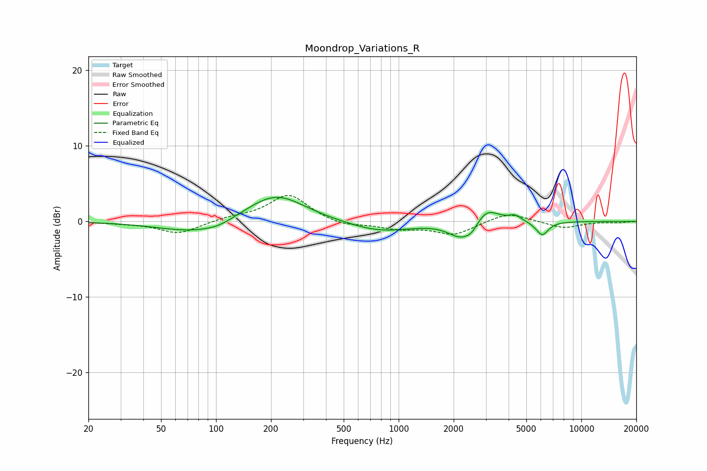

# Moondrop_Variations_R
See [usage instructions](https://github.com/jaakkopasanen/AutoEq#usage) for more options and info.

### Parametric EQs
Apply preamp of -3.3 dB when using parametric equalizer.

|   # | Type    |   Fc (Hz) |    Q |   Gain (dB) |
|-----|---------|-----------|------|-------------|
|   1 | Peaking |        77 | 0.72 |        -1.6 |
|   2 | Peaking |       103 | 1.8  |        -0.5 |
|   3 | Peaking |       188 | 0.84 |         0.8 |
|   4 | Peaking |       216 | 0.91 |         3   |
|   5 | Peaking |       790 | 0.82 |        -1.4 |
|   6 | Peaking |      2189 | 2.07 |        -2.1 |
|   7 | Peaking |      2510 | 4.13 |        -0.9 |
|   8 | Peaking |      3027 | 2.12 |         2.1 |
|   9 | Peaking |      4337 | 4.13 |         0.7 |
|  10 | Peaking |      6106 | 4.01 |        -1.9 |

### Fixed Band EQs
When using fixed band (also called graphic) equalizer, apply preamp of **-3.5 dB** (if available) and set gains manually with these parameters.

|   # | Type    |   Fc (Hz) |    Q |   Gain (dB) |
|-----|---------|-----------|------|-------------|
|   1 | Peaking |        31 | 1.41 |        -0.2 |
|   2 | Peaking |        62 | 1.41 |        -1.6 |
|   3 | Peaking |       125 | 1.41 |         0.5 |
|   4 | Peaking |       250 | 1.41 |         3.6 |
|   5 | Peaking |       500 | 1.41 |        -0.7 |
|   6 | Peaking |      1000 | 1.41 |        -0.9 |
|   7 | Peaking |      2000 | 1.41 |        -1.7 |
|   8 | Peaking |      4000 | 1.41 |         1.3 |
|   9 | Peaking |      8000 | 1.41 |        -0.9 |
|  10 | Peaking |     16000 | 1.41 |        -0.1 |

### Graphs

