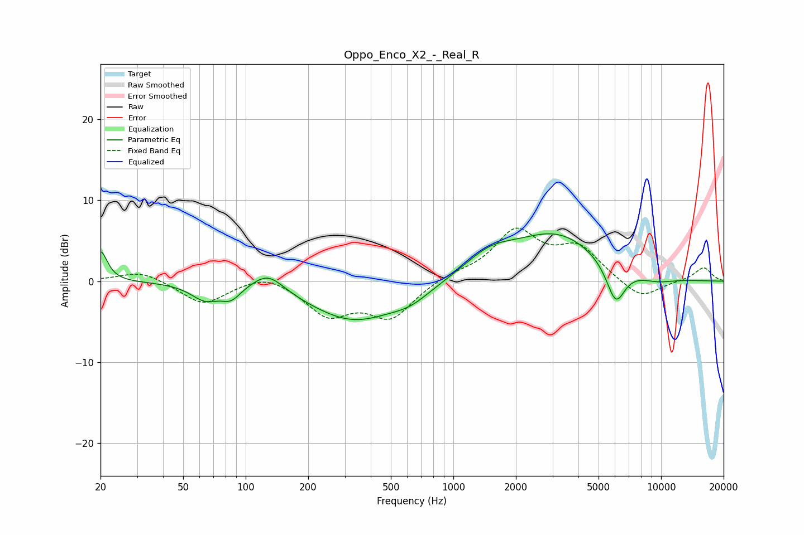

# Oppo_Enco_X2_-_Real_R
See [usage instructions](https://github.com/jaakkopasanen/AutoEq#usage) for more options and info.

### Parametric EQs
Apply preamp of -6.0 dB when using parametric equalizer.

|   # | Type    |   Fc (Hz) |    Q |   Gain (dB) |
|-----|---------|-----------|------|-------------|
|   1 | Peaking |        20 | 4.49 |         3.7 |
|   2 | Peaking |        64 | 2.07 |        -2   |
|   3 | Peaking |        85 | 3.07 |        -1.5 |
|   4 | Peaking |       128 | 1.86 |         2.3 |
|   5 | Peaking |       333 | 0.65 |        -4.8 |
|   6 | Peaking |       622 | 1.52 |        -1.2 |
|   7 | Peaking |      1488 | 1.15 |         2.4 |
|   8 | Peaking |      3144 | 0.65 |         5.7 |
|   9 | Peaking |      6049 | 2.96 |        -4.9 |
|  10 | Peaking |      9432 | 1.36 |        -0.8 |

### Fixed Band EQs
When using fixed band (also called graphic) equalizer, apply preamp of **-6.7 dB** (if available) and set gains manually with these parameters.

|   # | Type    |   Fc (Hz) |    Q |   Gain (dB) |
|-----|---------|-----------|------|-------------|
|   1 | Peaking |        31 | 1.41 |         1.4 |
|   2 | Peaking |        62 | 1.41 |        -2.9 |
|   3 | Peaking |       125 | 1.41 |         1.2 |
|   4 | Peaking |       250 | 1.41 |        -4   |
|   5 | Peaking |       500 | 1.41 |        -4.3 |
|   6 | Peaking |      1000 | 1.41 |         0.8 |
|   7 | Peaking |      2000 | 1.41 |         6   |
|   8 | Peaking |      4000 | 1.41 |         3.9 |
|   9 | Peaking |      8000 | 1.41 |        -2.3 |
|  10 | Peaking |     16000 | 1.41 |         1.7 |

### Graphs

