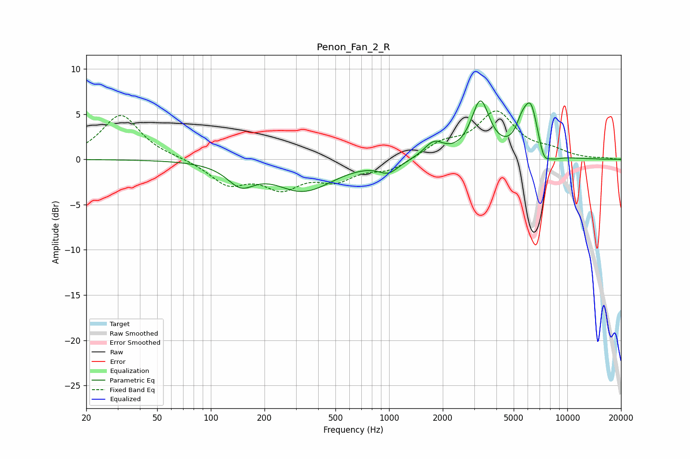

# Penon_Fan_2_R
See [usage instructions](https://github.com/jaakkopasanen/AutoEq#usage) for more options and info.

### Parametric EQs
Apply preamp of -6.6 dB when using parametric equalizer.

|   # | Type    |   Fc (Hz) |    Q |   Gain (dB) |
|-----|---------|-----------|------|-------------|
|   1 | Peaking |       147 | 1.86 |        -2.3 |
|   2 | Peaking |       337 | 0.94 |        -3.8 |
|   3 | Peaking |       353 | 1.55 |         0.4 |
|   4 | Peaking |       994 | 2.55 |        -1.2 |
|   5 | Peaking |      1782 | 2.56 |         1.7 |
|   6 | Peaking |      3255 | 2.76 |         6.1 |
|   7 | Peaking |      5530 | 4.24 |         1.7 |
|   8 | Peaking |      6237 | 3.19 |         5.5 |
|   9 | Peaking |      7367 | 4.51 |        -1.8 |
|  10 | Peaking |      8374 | 2.99 |        -0.5 |

### Fixed Band EQs
When using fixed band (also called graphic) equalizer, apply preamp of **-5.5 dB** (if available) and set gains manually with these parameters.

|   # | Type    |   Fc (Hz) |    Q |   Gain (dB) |
|-----|---------|-----------|------|-------------|
|   1 | Peaking |        31 | 1.41 |         4.9 |
|   2 | Peaking |        62 | 1.41 |         0.1 |
|   3 | Peaking |       125 | 1.41 |        -2.6 |
|   4 | Peaking |       250 | 1.41 |        -2.8 |
|   5 | Peaking |       500 | 1.41 |        -2   |
|   6 | Peaking |      1000 | 1.41 |        -1.2 |
|   7 | Peaking |      2000 | 1.41 |         1.6 |
|   8 | Peaking |      4000 | 1.41 |         5   |
|   9 | Peaking |      8000 | 1.41 |         0.8 |
|  10 | Peaking |     16000 | 1.41 |         0.1 |

### Graphs

