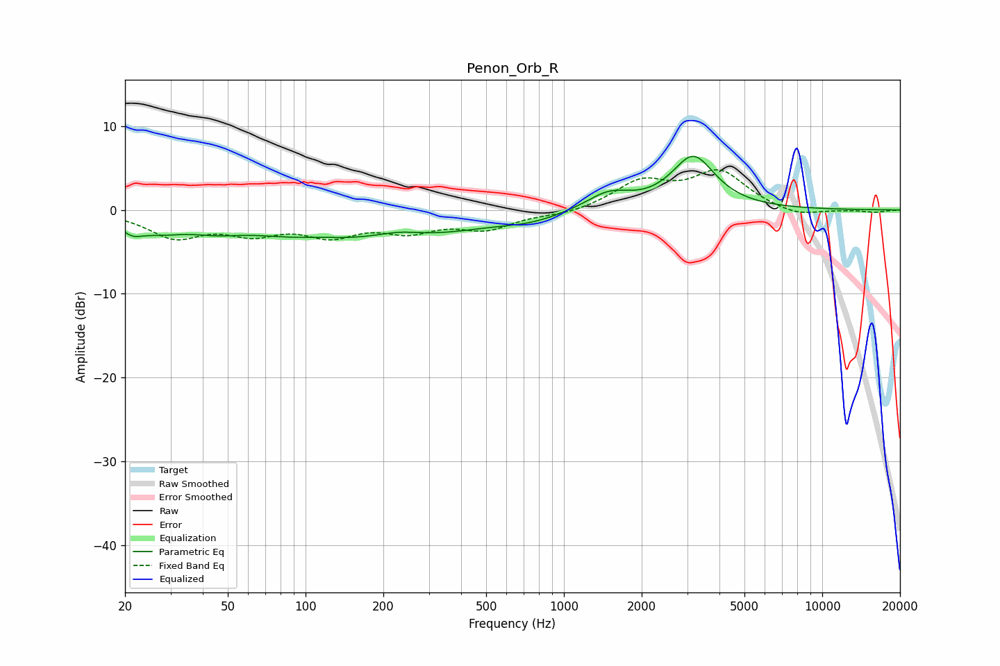

# Penon_Orb_R
See [usage instructions](https://github.com/jaakkopasanen/AutoEq#usage) for more options and info.

### Parametric EQs
Apply preamp of -6.5 dB when using parametric equalizer.

|   # | Type    |   Fc (Hz) |    Q |   Gain (dB) |
|-----|---------|-----------|------|-------------|
|   1 | Peaking |        21 | 3.39 |        -1.3 |
|   2 | Peaking |        27 | 1.37 |        -1.8 |
|   3 | Peaking |        45 | 1.28 |        -1.2 |
|   4 | Peaking |       108 | 0.64 |        -3.4 |
|   5 | Peaking |       111 | 1.25 |         0.9 |
|   6 | Peaking |       231 | 1.92 |         0.5 |
|   7 | Peaking |       328 | 0.61 |        -2   |
|   8 | Peaking |       749 | 1.15 |        -0.9 |
|   9 | Peaking |      1490 | 1.64 |         2   |
|  10 | Peaking |      3169 | 1.68 |         6.3 |

### Fixed Band EQs
When using fixed band (also called graphic) equalizer, apply preamp of **-4.9 dB** (if available) and set gains manually with these parameters.

|   # | Type    |   Fc (Hz) |    Q |   Gain (dB) |
|-----|---------|-----------|------|-------------|
|   1 | Peaking |        31 | 1.41 |        -3   |
|   2 | Peaking |        62 | 1.41 |        -2.3 |
|   3 | Peaking |       125 | 1.41 |        -2.6 |
|   4 | Peaking |       250 | 1.41 |        -2.1 |
|   5 | Peaking |       500 | 1.41 |        -2.1 |
|   6 | Peaking |      1000 | 1.41 |        -0.5 |
|   7 | Peaking |      2000 | 1.41 |         3.2 |
|   8 | Peaking |      4000 | 1.41 |         4.4 |
|   9 | Peaking |      8000 | 1.41 |        -0.9 |
|  10 | Peaking |     16000 | 1.41 |        -0.3 |

### Graphs

