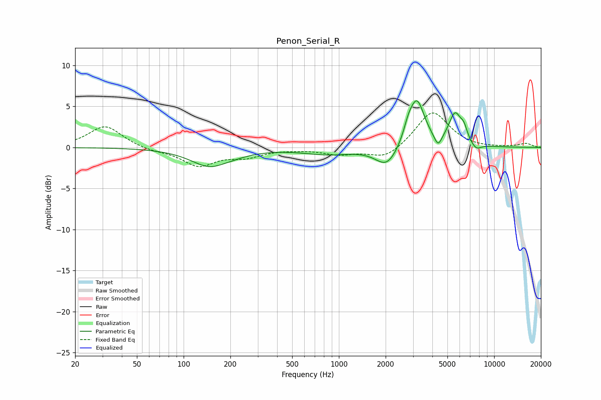

# Penon_Serial_R
See [usage instructions](https://github.com/jaakkopasanen/AutoEq#usage) for more options and info.

### Parametric EQs
Apply preamp of -5.8 dB when using parametric equalizer.

|   # | Type    |   Fc (Hz) |    Q |   Gain (dB) |
|-----|---------|-----------|------|-------------|
|   1 | Peaking |       154 | 1.11 |        -2.6 |
|   2 | Peaking |       172 | 2.12 |         0.3 |
|   3 | Peaking |       850 | 0.88 |        -0.8 |
|   4 | Peaking |      2038 | 1.96 |        -2.4 |
|   5 | Peaking |      2792 | 4.82 |         1.3 |
|   6 | Peaking |      3178 | 2.8  |         5.7 |
|   7 | Peaking |      4353 | 5.86 |        -1.5 |
|   8 | Peaking |      5595 | 3.38 |         3.8 |
|   9 | Peaking |      6380 | 6    |         1.3 |
|  10 | Peaking |      7639 | 4.16 |        -0.8 |

### Fixed Band EQs
When using fixed band (also called graphic) equalizer, apply preamp of **-4.3 dB** (if available) and set gains manually with these parameters.

|   # | Type    |   Fc (Hz) |    Q |   Gain (dB) |
|-----|---------|-----------|------|-------------|
|   1 | Peaking |        31 | 1.41 |         2.7 |
|   2 | Peaking |        62 | 1.41 |        -0.4 |
|   3 | Peaking |       125 | 1.41 |        -2.2 |
|   4 | Peaking |       250 | 1.41 |        -1   |
|   5 | Peaking |       500 | 1.41 |        -0.1 |
|   6 | Peaking |      1000 | 1.41 |        -0.8 |
|   7 | Peaking |      2000 | 1.41 |        -1.5 |
|   8 | Peaking |      4000 | 1.41 |         4.5 |
|   9 | Peaking |      8000 | 1.41 |        -0.1 |
|  10 | Peaking |     16000 | 1.41 |         0.5 |

### Graphs

