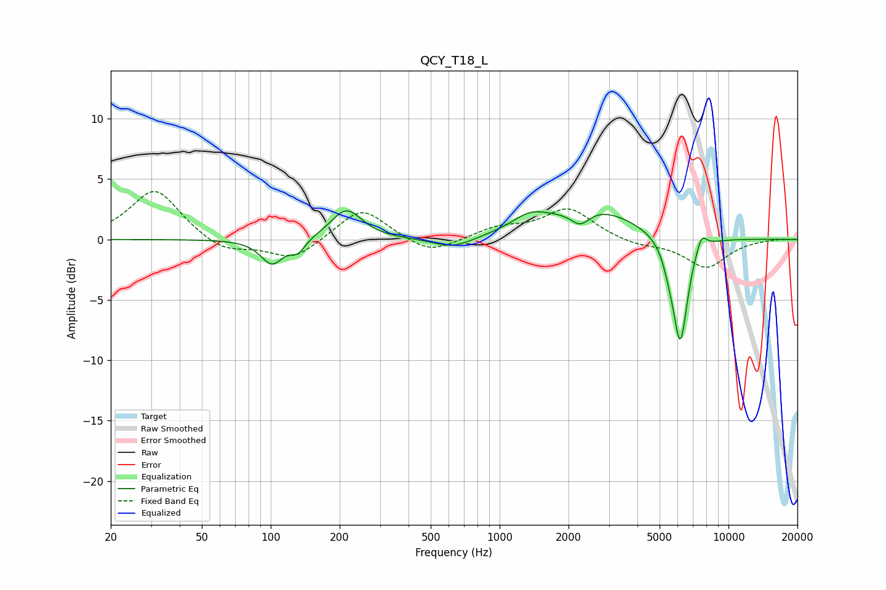

# QCY_T18_L
See [usage instructions](https://github.com/jaakkopasanen/AutoEq#usage) for more options and info.

### Parametric EQs
Apply preamp of -2.5 dB when using parametric equalizer.

|   # | Type    |   Fc (Hz) |    Q |   Gain (dB) |
|-----|---------|-----------|------|-------------|
|   1 | Peaking |       101 | 2.87 |        -2.1 |
|   2 | Peaking |       132 | 4.61 |        -1   |
|   3 | Peaking |       214 | 2.1  |         2.5 |
|   4 | Peaking |       626 | 1.57 |        -0.9 |
|   5 | Peaking |      1358 | 1.77 |         1.2 |
|   6 | Peaking |      2249 | 3.33 |        -1.3 |
|   7 | Peaking |      2576 | 0.75 |         2.6 |
|   8 | Peaking |      5505 | 5.35 |        -1   |
|   9 | Peaking |      6156 | 4.16 |        -8.8 |
|  10 | Peaking |      7613 | 5.78 |         1.4 |

### Fixed Band EQs
When using fixed band (also called graphic) equalizer, apply preamp of **-4.1 dB** (if available) and set gains manually with these parameters.

|   # | Type    |   Fc (Hz) |    Q |   Gain (dB) |
|-----|---------|-----------|------|-------------|
|   1 | Peaking |        31 | 1.41 |         4.2 |
|   2 | Peaking |        62 | 1.41 |        -1.1 |
|   3 | Peaking |       125 | 1.41 |        -1.7 |
|   4 | Peaking |       250 | 1.41 |         2.7 |
|   5 | Peaking |       500 | 1.41 |        -1.3 |
|   6 | Peaking |      1000 | 1.41 |         0.9 |
|   7 | Peaking |      2000 | 1.41 |         2.5 |
|   8 | Peaking |      4000 | 1.41 |        -0.5 |
|   9 | Peaking |      8000 | 1.41 |        -2.3 |
|  10 | Peaking |     16000 | 1.41 |         0.1 |

### Graphs

