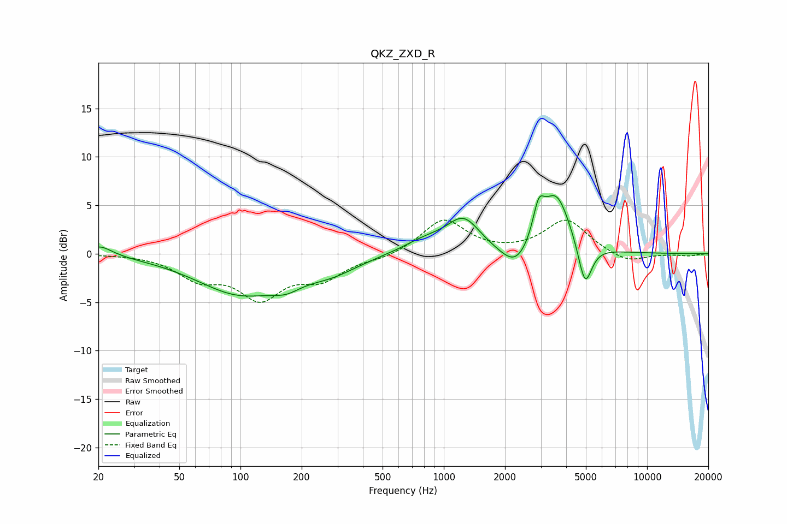

# QKZ_ZXD_R
See [usage instructions](https://github.com/jaakkopasanen/AutoEq#usage) for more options and info.

### Parametric EQs
Apply preamp of -6.1 dB when using parametric equalizer.

|   # | Type    |   Fc (Hz) |    Q |   Gain (dB) |
|-----|---------|-----------|------|-------------|
|   1 | Peaking |        20 | 2.29 |         1.1 |
|   2 | Peaking |        99 | 0.66 |        -4   |
|   3 | Peaking |       168 | 1.91 |        -1   |
|   4 | Peaking |       280 | 1.06 |        -1.4 |
|   5 | Peaking |       813 | 1.23 |         1.2 |
|   6 | Peaking |      1252 | 1.73 |         3.3 |
|   7 | Peaking |      2269 | 1.88 |        -2.6 |
|   8 | Peaking |      2928 | 5.07 |         3.2 |
|   9 | Peaking |      3564 | 1.96 |         6.2 |
|  10 | Peaking |      4950 | 4.11 |        -4.7 |

### Fixed Band EQs
When using fixed band (also called graphic) equalizer, apply preamp of **-3.6 dB** (if available) and set gains manually with these parameters.

|   # | Type    |   Fc (Hz) |    Q |   Gain (dB) |
|-----|---------|-----------|------|-------------|
|   1 | Peaking |        31 | 1.41 |         0   |
|   2 | Peaking |        62 | 1.41 |        -2.3 |
|   3 | Peaking |       125 | 1.41 |        -4.2 |
|   4 | Peaking |       250 | 1.41 |        -2.3 |
|   5 | Peaking |       500 | 1.41 |        -0.4 |
|   6 | Peaking |      1000 | 1.41 |         3.6 |
|   7 | Peaking |      2000 | 1.41 |        -0   |
|   8 | Peaking |      4000 | 1.41 |         3.5 |
|   9 | Peaking |      8000 | 1.41 |        -1   |
|  10 | Peaking |     16000 | 1.41 |        -0.2 |

### Graphs

